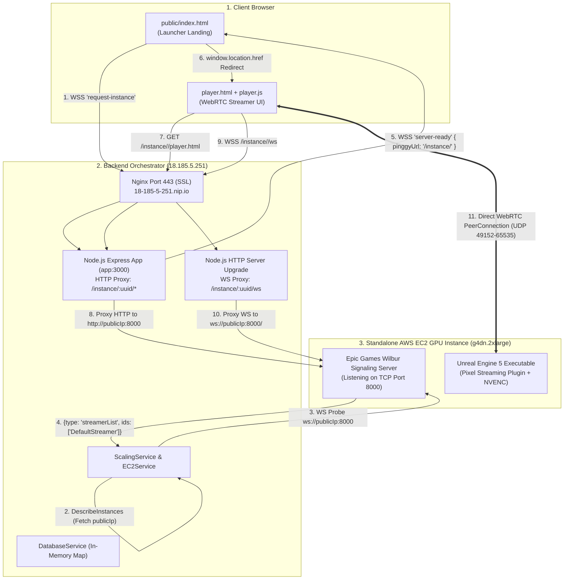
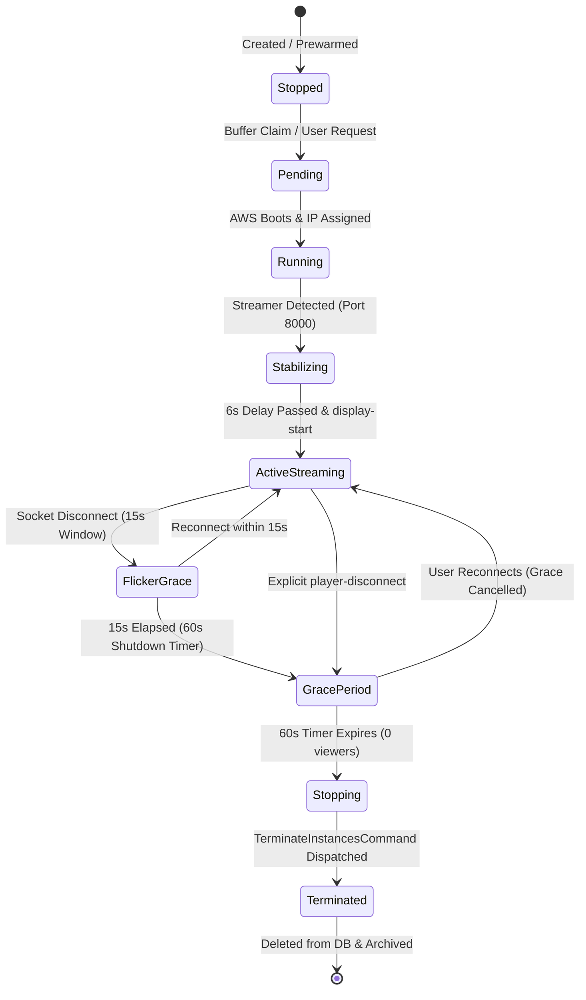

# EXHAUSTIVE CLOSED-TESTING RELIABILITY AUDIT: USER ENTRY FLOW & POOL MANAGEMENT (БАЗА / ДОП.)

**Project**: `maximall-web` (Orchestrator Backend)  
**Target & Current Repository State**: Branch `dev` @ Commit `7aba0f8641e28bfb6b3e043c6ca5fb95ada27bdc`  
**Commit Message**: `feat: preserve custom boothStates level layout in saves endpoint`  
**Audit Scope**: Closed-testing functional correctness, user entry reliability («ВОЙТИ В 3D КОМНАТУ»), Node.js reverse proxy architecture (port 8000), AWS EC2 lifecycle, and dashboard pool controls (**База** & **Доп.**).  
**Audit Mode**: Forensic Read-Only Inspection (No code or configuration modified).

---

## 1. EXACT VERIFIED GIT STATE

- **Current Branch**: `dev` (matching `origin/dev`)
- **Exact HEAD Commit Hash**: `7aba0f8641e28bfb6b3e043c6ca5fb95ada27bdc` (short: `7aba0f8`)
- **Commit Author & Date**: `adavtyan815-art <Nar-ek>`, `Wed Jul 15 14:26:09 2026 +0400`
- **Tracked Working Tree**: **100% Clean** (exact match with `origin/dev`).
- **Untracked Diagnostic Files**: Preserved without modification (`COMPLETE_SYSTEM_TECHNICAL_AUDIT.md`, `PRODUCTION_READINESS_FORENSIC_AUDIT_REPORT.md`, `CURRENT_3D_ROOM_FLOW_ANALYSIS.md`, `.agents/`, `terraform/`).

---

## 2. CURRENT PINGGY-FREE ARCHITECTURE

On the `dev` branch (`7aba0f8`), the networking path has been **completely refactored to eliminate the external Pinggy reverse tunnel service**. All Pixel Streaming HTTP assets and WebSocket signaling traffic are proxied directly through the backend server.



### Classification of Pinggy Code Artifacts in `dev`:
1. **`ScalingService.ts` Phase 2**: **Bypassed / Replaced**. `console.log('${tag} Phase 2 TUNNEL: Bypassed. Using direct IP for proxying.')`.
2. **`headers: { 'X-Pinggy-No-Screen': 'true' }` (`websocketService.ts:401`)**: **Legacy / Dead Code**. Retained in WebSocket probe constructor; ignored by Wilbur on port 8000.
3. **`pinggyUrl?: string` field in types & DB**: **Compatibility Alias**. Reused to carry the relative proxy path string `'/instance/' + uuid`.
4. **`POST /api/instances/:uuid/report-tunnel` (`app.ts:688`)**: **Legacy / Fallback Route**. Kept for backwards compatibility with legacy AMI boot scripts; ignored by current prewarm and user flows.

---

## 3. COMPLETE “ENTER 3D ROOM” USER FLOW

```mermaid
sequenceDiagram
    autonumber
    actor User as User Browser
    participant Launcher as public/index.html
    participant WS as WebSocketService
    participant Scale as ScalingService
    participant AWS as AWS EC2 API
    participant Proxy as Node.js HTTP/WS Proxy
    participant EC2 as GPU Instance (Port 8000)

    Note over User, Launcher: 1. INITIALIZATION & INTENT
    User->>Launcher: Opens site (retrieves/generates deviceId)
    Launcher->>WS: WS emit 'check-active-session' { deviceId }
    WS-->>Launcher: WS emit 'session-not-found'
    User->>Launcher: Clicks "ВОЙТИ В 3D КОМНАТУ"
    Launcher->>Launcher: Disable #btn, showLoadingUI() (progress bar starts)
    Launcher->>WS: WS emit 'request-instance' { hostToken, deviceId }

    Note over WS, AWS: 2. ALLOCATION & BUFFER CLAIM
    WS->>Scale: claimBufferInstance()
    alt Buffer Instance Available (Stopped)
        Scale->>Scale: Mark assignedTo = 'LinuxClient', status = 'pending'
        Scale->>AWS: StartInstancesCommand(instanceId)
        WS-->>Launcher: WS emit 'instance-assigned' { uuid, hostToken, rescued: false }
    else Buffer Pool Empty
        Scale->>AWS: RunInstancesCommand(g4dn.2xlarge, LinuxClientAMI)
        WS-->>Launcher: WS emit 'instance-assigned' { uuid, hostToken, rescued: false }
    end

    Note over WS, EC2: 3. READINESS POLLING & STABILIZATION
    WS->>WS: startAwsStatusPoll(socket, uuid, hostToken) [Every 3s]
    loop Every 3s Poll
        WS->>AWS: DescribeInstances (Get state & publicIp)
        WS->>EC2: WS Probe ws://publicIp:8000 {"type": "listStreamers"}
        EC2-->>WS: {"type": "streamerList", "ids": ["DefaultStreamer"]}
    end
    Note over WS: 6-Second Media Stabilization Delay
    WS->>WS: Sleep 6000ms & re-verify streamer connection
    WS-->>Launcher: WS emit 'server-ready' { pinggyUrl: '/instance/<uuid>' }

    Note over Launcher, EC2: 4. PROXIED REDIRECT & WEBRTC
    Launcher->>Launcher: Complete progress to 100%
    Launcher->>User: window.location.href = /instance/<uuid>/player.html?...&ss=wss://.../instance/<uuid>/ws
    User->>Proxy: GET /instance/<uuid>/player.html
    Proxy->>EC2: Proxy HTTP to http://publicIp:8000/player.html
    User->>Proxy: WSS /instance/<uuid>/ws
    Proxy->>EC2: Proxy WS to ws://publicIp:8000/
    User<->EC2: WebRTC PeerConnection Established (Video/Audio Stream Active)

    Note over User, WS: 5. SESSION REGISTRATION & TELEMETRY
    User->>WS: WS emit 'join-instance' & 'display-start' { instanceUuid, hostToken, deviceId }
    WS->>WS: Start 45s heartbeat watchdog & real billing timer
    WS-->>User: WS emit 'display-started' { idleTimeoutMinutes }
    loop Every 10s Heartbeat
        User->>WS: WS emit 'heartbeat' { deviceId }
        WS-->>User: WS emit 'heartbeat-ack'
    end
```

---

## 4. USER-VISIBLE BEHAVIOR AT EACH STAGE

| Stage | Frontend State | Progress Bar % | User-Visible Text / UI Element | Underlying System Event |
| :--- | :--- | :--- | :--- | :--- |
| **0. Initial Load** | `#launcher-ui` visible | 0% | Button: `«ВОЙТИ В 3D КОМНАТУ»` | Socket connects; checks `deviceId` for auto-resume. |
| **1. Click Dispatch** | `#loading-ui` flex | 0% $\rightarrow$ 15% | `«Поиск доступного сервера...»` | Button disabled; `request-instance` emitted. |
| **2. AWS Pending** | `#loading-ui` flex | 15% $\rightarrow$ 49% | `«Подготовка виртуальной машины...»` | Instance claimed/spawned; waiting for AWS `running`. |
| **3. Booting Server** | `#loading-ui` flex | 50% $\rightarrow$ 79% | `«Запуск 3D приложения...»` | EC2 is `running`; polling port 8000 for UE5 streamer. |
| **4. Stabilization** | `#loading-ui` flex | 80% $\rightarrow$ 99% | `«Стабилизация видеопотока...»` | Streamer detected; 6-second delay running. |
| **5. Ready & Redirect** | `#loading-ui` fade-out | 100% | `«Соединение установлено.»` | `server-ready` received; redirecting to `/instance/<uuid>/player.html`. |
| **6. Active Stream** | Fullscreen 3D View | N/A | Interactive Unreal Engine 3D Scene + Time Bar | WebRTC video playing; 10s heartbeats running. |

---

## 5. COMPLETE STATE-TRANSITION MAP



---

## 6. TIMING, POLLING, RETRY & TIMEOUT MAP

| Operation | Interval / Delay | Timeout / Max Tries | Handled By | Action on Failure / Expiry |
| :--- | :--- | :--- | :--- | :--- |
| **Client Progress Simulation** | Every `30ms` | Capped at 49% / 79% | `public/index.html` | Waits for server socket status events. |
| **Status Polling (`startAwsStatusPoll`)** | Every `3000ms` | **NO TIMEOUT (Infinite)** ⚠️ | `websocketService.ts:373` | Retries indefinitely if streamer never connects. |
| **WebSocket Probe (`listStreamers`)** | On each poll | `4000ms` safety timer | `websocketService.ts:405` | Resolves `false` and retries on next poll tick. |
| **Streamer Stabilization Delay** | One-shot `6000ms` | 1 verification re-check | `websocketService.ts:444` | If streamer dropped during 6s, resumes polling. |
| **Heartbeat Interval (Client $\rightarrow$ Server)** | Every `10000ms` | N/A | `player.js:284` | Sends `{ deviceId, hostToken }`. |
| **Server Heartbeat Watchdog** | Checked every `10s` | `45000ms` (4.5 intervals) | `websocketService.ts:784` | Unbinds socket and starts 60s grace period. |
| **Flicker Recovery Window** | One-shot `15000ms` | 1 check | `websocketService.ts:713` | If reconnected, cancels grace; else starts 60s grace. |
| **Grace Period Shutdown Countdown** | One-shot `60000ms` | 1 check | `timeTrackerService.ts:80` | Calls `terminateAndRemove(instanceId)`. |
| **Automatic Pool Reconciliation** | Every `60000ms` | Perpetual | `scalingService.ts:199` | Launches prewarms if `bufferCount < minBufferTarget`. |

---

## 7. ALL DISCOVERED ENTRY-FLOW BUGS & EDGE CASES

---

### Finding `BUG-01` (Severity: **HIGH**)
- **Scenario**: Normal user clicks «ВОЙТИ В 3D КОМНАТУ», and the 3D application becomes ready.
- **Expected Behavior**: Server emits a single `server-ready` event, progress reaches 100%, and the browser redirects smoothly to `/instance/<uuid>/player.html`.
- **Actual Behavior**: The server emits **duplicate `server-ready` events** 3 seconds apart.
- **What the Client Sees**: Browser executes redirect, but a second `server-ready` event arrives while the page is navigating, occasionally causing a double-navigation flicker or aborting the redirect on slow mobile connections.
- **Root Cause**:
  In [`src/services/websocketService.ts:443-450`](file:///c:/Users/Admin/Desktop/Aleg/maximall-web/src/services/websocketService.ts#L443-L450) and [`lines 484-491`](file:///c:/Users/Admin/Desktop/Aleg/maximall-web/src/services/websocketService.ts#L484-L491):
  `startAwsStatusPoll` runs on `setInterval(..., 3000)`. When `isStreamerReady` is true, it executes `await new Promise(r => setTimeout(r, 6000))`. The next 3000ms interval tick triggers while the first tick is sleeping. Both ticks pass the streamer check and both call `socket.emit('server-ready', ...)`.
- **Exact Code Location**: `src/services/websocketService.ts:444` & `src/services/websocketService.ts:485`.

---

### Finding `BUG-02` (Severity: **HIGH**)
- **Scenario**: Unreal Engine 5 crashes upon booting inside the EC2 AMI (e.g. shader compilation error or driver crash).
- **Expected Behavior**: After a reasonable timeout (e.g. 2–3 minutes), the frontend stops loading, displays an error message, and the backend cleans up the faulty instance.
- **Actual Behavior**: The frontend progress bar remains **permanently stuck at 79% («Запуск 3D приложения...»)** forever.
- **What the Client Sees**: Infinite loading screen with spinning progress bar. No error banner appears. Refreshing the page resumes the stuck session.
- **Root Cause**:
  `startAwsStatusPoll` has **no maximum retry counter or timeout limit**. Since Wilbur responds with `{"type": "streamerList", "ids": []}`, `isStreamerReady` returns `false` perpetually.
- **Exact Code Location**: `src/services/websocketService.ts:373-516`.

---

### Finding `BUG-03` (Severity: **HIGH**)
- **Scenario**: A user has Tab 1 actively streaming, and opens Tab 2 on the same computer clicking «ВОЙТИ В 3D КОМНАТУ».
- **Expected Behavior**: Tab 2 recognizes the existing active session and attaches to the running instance without spinning up extra cloud infrastructure.
- **Actual Behavior**: Tab 2 bypasses device rescue and **allocates a second independent GPU instance**.
- **What the Client Sees**: Tab 2 starts a new 3D instance. When Tab 2 redirects, it overwrites `hostToken` in `localStorage`, causing Tab 1's heartbeat to fail with `"Session locked to another device"`.
- **Root Cause**:
  In [`src/services/websocketService.ts:183-185`](file:///c:/Users/Admin/Desktop/Aleg/maximall-web/src/services/websocketService.ts#L183-L185), the rescue guard requires `(inGrace || noActiveSocket)`. Because Tab 1 has an active socket, this evaluates to `false`, causing the backend to claim/spawn a brand-new instance.
- **Exact Code Location**: `src/services/websocketService.ts:183-205`.

---

### Finding `BUG-04` (Severity: **MEDIUM**)
- **Scenario**: A buffer instance is claimed, but AWS EC2 API fails to start it (e.g. transient AWS capacity or rate limit error).
- **Expected Behavior**: The instance is rolled back to the buffer pool, and pool targets remain accurate.
- **Actual Behavior**: The instance rolls back to the buffer, but `ScalingService` has already launched a replacement prewarm instance, creating buffer pool overshoot.
- **What the Client Sees**: User receives an error message, but an unwanted extra GPU instance prewarms in the background.
- **Root Cause**:
  `claimBufferInstance()` schedules `setTimeout(() => this.reconcilePool(), 0)` immediately upon claiming, before `ec2Service.startInstance()` has succeeded.
- **Exact Code Location**: `src/services/scalingService.ts:598` & `src/services/websocketService.ts:253-263`.

---

### Finding `BUG-05` (Severity: **MEDIUM**)
- **Scenario**: A user's mobile device or laptop goes to sleep for >45 seconds during active streaming, then wakes up.
- **Expected Behavior**: Heartbeats resume, socket association is restored, and future disconnects trigger proper teardown.
- **Actual Behavior**: The session recovers streaming, but enters a **zombie state** where `session.socketId` remains `undefined`.
- **What the Client Sees**: Stream continues working, but when the user eventually closes the tab, the 15-second flicker window fails to fire and instance termination is delayed by up to 60 seconds.
- **Root Cause**:
  In `src/services/websocketService.ts:633-658`, `handleHeartbeat` updates `lastSeenAt` and cancels grace period, but does not restore `session.socketId = socket.id` or restart `startHeartbeatMonitor`.
- **Exact Code Location**: `src/services/websocketService.ts:633-658` & `src/services/websocketService.ts:804-818`.

---

### Finding `BUG-06` (Severity: **LOW**)
- **Scenario**: Client encounters an internet disconnect while the loading screen is active.
- **Expected Behavior**: An error banner is shown with a «Повторить» (Retry) button to reconnect.
- **Actual Behavior**: Text says `"Ошибка сервера. Проверьте интернет."`, but the launcher button `#btn` remains hidden (`display: none`).
- **What the Client Sees**: Frozen error message with no way to retry other than manually reloading the browser page.
- **Root Cause**: `socket.on('connect_error')` does not un-hide `#launcher-ui`.
- **Exact Code Location**: `public/index.html:560-567`.

---

## 8. REFRESH, RECONNECT & DISCONNECT BEHAVIOR MATRIX

| User Action | Client State | Backend Response | Outcome |
| :--- | :--- | :--- | :--- |
| **Refresh during `pending` boot** | `sessionStorage` retains `assignedUuid` & `globalHostToken` | Socket reconnects $\rightarrow$ `resume-instance` $\rightarrow$ attaches to existing `startAwsStatusPoll` | **Clean Recovery**: Progress bar resumes from 49%/79% without spawning new instances. |
| **Refresh during active 3D stream** | `player.js` emits `player-disconnect` on unload; page reloads and emits `display-start` | `player-disconnect` starts 60s grace; reload `display-start` **instantly cancels grace period** | **Clean Recovery**: WebRTC reconnects within 1–2 seconds. |
| **Network drop (<15s flicker)** | Socket drops abruptly | 15s flicker delay starts; socket reconnects; grace period is averted | **Clean Recovery**: Zero user impact. |
| **Close browser tab** | `beforeunload` emits `player-disconnect` | Starts 60s grace timer; after 60s, instance is terminated | **Correct Teardown**: GPU instance destroyed on AWS. |
| **Idle Timeout Redirection** | Redirects to `/?reason=idle` | `public/index.html` purges `sessionStorage` tokens; skips auto-resume | **Clean Reset**: User returned to clean launcher screen. |

---

## 9. STUCK-STATE AUDIT

1. **Stuck at 49%**: Occurs only if AWS EC2 hangs in `pending` state for >10 minutes (AWS infrastructure issue).
2. **Stuck at 79%**: **Confirmed Real Bug (`BUG-02`)**. Occurs whenever UE5 crashes on boot inside the AMI, because `startAwsStatusPoll` lacks a timeout.
3. **Stuck at «ОЖИДАЙТЕ ЗАВЕРШЕНИЯ...»**: Occurs if an instance is in `stopping` state. Correctly unblocks once AWS confirms `stopped`.

---

## 10. EC2 LIFECYCLE CORRECTNESS

- **Buffer Start**: Uses `ec2Service.startInstance()` on stopped instances. Correctly fetches fresh dynamic public IP upon reaching `running`.
- **On-Demand Spawn**: Uses `ec2Service.createInstance('g4dn.2xlarge', amiId, subnetId, securityGroupId)`. Correctly configures networking and tags.
- **Termination**: Uses `ec2Service.terminateInstance()`. Correctly cleans up AWS resources upon grace period expiry or admin deletion.

---

## 11. PIXEL STREAMING READINESS CORRECTNESS

- **Signaling Probe**: Directly connects to `ws://${publicIp}:8000` and executes `{"type": "listStreamers"}`.
- **Streamer Verification**: Requires `msg.ids.length > 0` (`DefaultStreamer`).
- **Stabilization Delay**: Waits 6 seconds and re-probes before redirecting. Successfully eliminates the "black screen / connection refused" WebRTC handshake race.

---

## 12. БАЗА — EXACT TECHNICAL MEANING

- **What it represents**: The **permanent baseline floor** for ready, stopped Buffer instances.
- **Where it is stored**: In `SettingsService` (`settings.minBufferTarget`), stored in memory and returned by `GET /api/settings`.
- **Persistence across restarts**: Defaults to `0` (passive startup) on fresh boot unless configured in settings.
- **Automatic 60s Loop Integration**: Every 60 seconds, `reconcilePool()` reads `minBufferTarget` (**База**). If `bufferCount < minBufferTarget`, it calculates `deficit = minBufferTarget - bufferCount - prewarmCount` and launches prewarm instances.
- **Surplus Handling**: If `bufferCount > minBufferTarget`, `reconcilePool()` **does nothing** (suppresses prewarming, never terminates surplus instances).

---

## 13. ДОП. — EXACT TECHNICAL MEANING

- **What it represents**: A **one-shot extra capacity boost** added on top of **База** during manual realignment.
- **Scope & Duration**: Affects **only the immediate `realignPool()` execution**. It does **not** alter the 60s automatic reconciliation floor (`minBufferTarget`).
- **Post-Prewarm Behavior**: After extra instances finish prewarming, they enter the buffer pool as `assignedTo = 'Buffer'`, `status = 'stopped'`.
- **Removal Mechanism**: Extra instances remain in the buffer until claimed by users, manually deleted, or until an admin clicks «Применить и выровнять» with a lower combined target (e.g. `2 + 0`). Setting Доп. to 0 and clicking Apply terminates the surplus buffer instances.

---

## 14. БАЗА + ДОП. SCENARIO MATRIX

| Configuration | Action Taken | Expected Final AWS / Buffer State | Code Guaranteed? |
| :--- | :--- | :--- | :--- |
| **База = 0, Доп. = 0** | Click Apply | 0 Buffer, 0 Prewarm (Terminates all stopped buffer instances). | **YES** |
| **База = 1, Доп. = 0** | Click Apply | 1 ready Buffer instance. Auto-loop maintains minimum 1. | **YES** |
| **База = 2, Доп. = 0** | Click Apply | 2 ready Buffer instances. Auto-loop maintains minimum 2. | **YES** |
| **База = 2, Доп. = 1** | Click Apply | 3 total instances prewarmed (2 Base + 1 Extra). Auto-loop floor is 2. | **YES** |
| **База = 2, Доп. = 3** | Click Apply | 5 total instances prewarmed (2 Base + 3 Extra). Auto-loop floor is 2. | **YES** |
| **Change 2+3 $\rightarrow$ 2+0** | Click Apply | Immediately terminates 3 surplus Buffer instances, leaving exactly 2. | **YES** |
| **Change 3+0 $\rightarrow$ 1+0** | Click Apply | Immediately terminates 2 surplus Buffer instances, leaving exactly 1. | **YES** |
| **Rapid Double Click Apply** | Click Apply twice | `launchingCount` increments synchronously; second click sees updated count. | **YES (with minor async window)** |
| **Apply while Prewarm in-flight** | Click Apply | Surplus prewarms are skipped (not terminated mid-flight) to prevent corruption. | **YES** |
| **User Claims Buffer during Apply** | User enters 3D | Claim immediately renames instance to `LinuxClient`, preventing termination. | **YES** |

---

## 15 & 16. POOL RECONCILIATION & REALIGNMENT CORRECTNESS

1. **Reconciliation Loop (`reconcilePool`)**:
   - Correctly includes `ghost purge` (removes DB records if instances are terminated externally in AWS Console).
   - Correctly handles `minBufferTarget = 0` (honors passive startup).
2. **Realignment Engine (`realignPool`)**:
   - Correctly computes `combinedTarget = baseTarget + extraBoost`.
   - Correctly uses **LIFO order** (terminates newest Buffer instances first to preserve longest-idling instances).
   - Never aborts in-progress Prewarm lifecycles (logs warning and lets them complete into buffer).

---

## 17. RACE CONDITIONS & CONCURRENCY RISKS

1. **Reconcile vs. Realign Overlap**:
   If the 60-second automatic loop runs at the exact same second the admin clicks «Применить и выровнять», both compute deficits before instances are launched, causing duplicate prewarm launches.
2. **Buffer Claim Rollback Overshoot (`BUG-04`)**:
   If AWS fails to start a claimed buffer instance, the rollback adds the instance back to the buffer while `reconcilePool()` has already been dispatched to replace it.

---

## 18. CLOSED-TESTING BLOCKERS

1. **[BLOCKER 1] Infinite 79% Loading Screen on UE5 Boot Crash (`BUG-02`)**: Must add a timeout to `startAwsStatusPoll`.
2. **[BLOCKER 2] Duplicate `server-ready` Events (`BUG-01`)**: Must prevent overlapping `setInterval` ticks during the 6-second stabilization delay.
3. **[BLOCKER 3] Multi-Tab Session Collision (`BUG-03`)**: Must attach second tabs to the existing running instance rather than spawning duplicate GPU instances.

---

## 19. RECOMMENDED FIX PRIORITY (FUNCTIONAL RELIABILITY ONLY)

```text
Priority 1 (Fix User-Visible Stuck States & Navigation Glitches):
  1. Add isStabilizing flag in startAwsStatusPoll to eliminate duplicate server-ready events (BUG-01).
  2. Add 3-minute max retry limit to startAwsStatusPoll to prevent infinite 79% hangs (BUG-02).
  3. Fix multi-tab device rescue in handleRequestInstance to prevent duplicate GPU spawning (BUG-03).

Priority 2 (State & Lifecycle Robustness):
  4. Restore session.socketId and restart heartbeat watchdog in handleHeartbeat (BUG-05).
  5. Only trigger reconcilePool() in claimBufferInstance after startInstance resolves (BUG-04).
  6. Add isReconciling mutex lock between reconcilePool and realignPool.

Priority 3 (UI Polish):
  7. Add a "Повторить" button to the launcher error banner on socket disconnect (BUG-06).
```

---

## 20. FINAL VERDICT

```text
========================================================================================
                               FUNCTIONAL BUT HAS BUGS
========================================================================================
```

### Executive Summary of Verdict:
The core Pinggy-free architecture on `dev` (`7aba0f8`) is **architecturally sound and significantly superior to the legacy tunnel design**. The Node.js HTTP/WS reverse proxy on port 8000, 6-second stabilization delay, and dashboard **База + Доп.** pool controls work as intended in standard single-user test runs. However, **3 functional bugs** (`BUG-01` duplicate ready events, `BUG-02` infinite 79% loading hang on UE5 crash, and `BUG-03` multi-tab instance duplication) must be addressed to ensure seamless closed testing.

---

*Audit completed with zero code or configuration modifications.*
