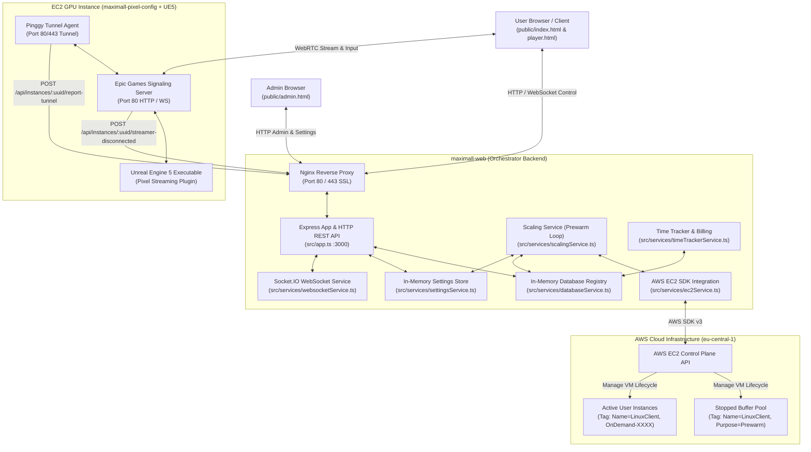
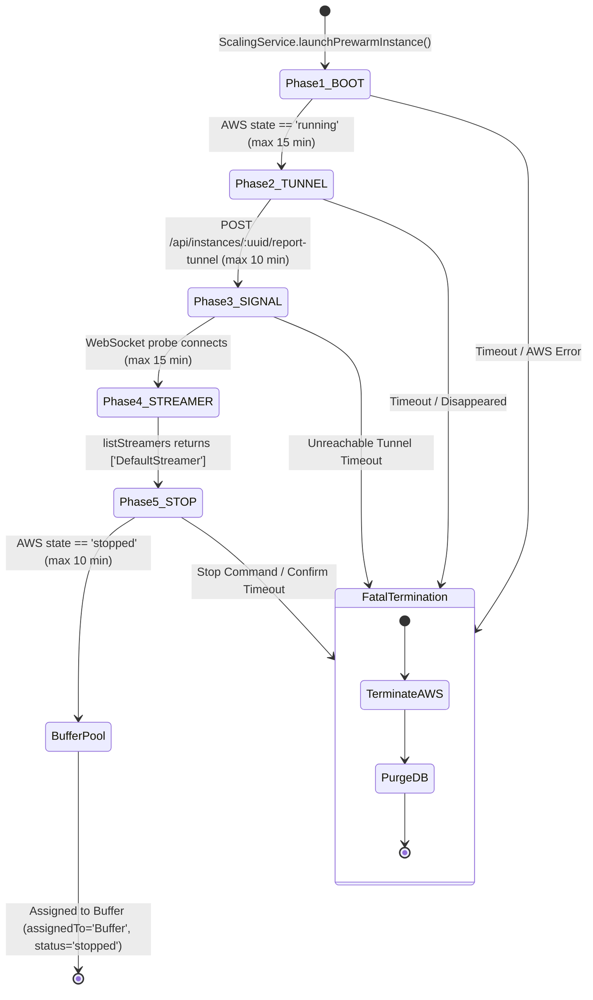

# COMPLETE TECHNICAL SYSTEM AUDIT & ARCHITECTURAL SPECIFICATION
**Project:** `maximall-web` (Orchestrator Backend)  
**Repository State:** `main` branch @ `4fbbc35490c2e3cfed71af2e837c789b44bd9b35`  
**Commit Message:** `docs: add custom domain & SSL integration guide`  
**Document Classification:** Primary Technical Context & System Audit Deliverable  
**Date of Audit:** August 20, 2026  

---

## 1. Executive System Overview

### 1.1 Purpose & Mission
`maximall-web` is a high-performance, single-process Node.js/TypeScript orchestrator backend designed to manage on-demand, hot-standby AWS EC2 GPU instances for an interactive 3D WebRTC Pixel Streaming application (powered by Unreal Engine 5 and Epic Games Pixel Streaming). 

The primary operational challenge it solves is **eliminating the 2–3 minute cold-boot latency** of AWS GPU instances (such as `g4dn.2xlarge`). By maintaining a managed, warm, stopped buffer pool of pre-configured GPU instances in AWS, the orchestrator delivers **sub-2-second connection times** to end-users who click to enter the 3D space, while enforcing strict lifecycle management, heartbeat monitoring, idle timeout teardown, and 60-second minimum AWS billing reconciliation to prevent infrastructure cost overruns.

### 1.2 The Three Interconnected Projects
As defined in the project governance rules (`.agents/rules/Golden_Rule_for_All.md`), the complete platform operates across three interconnected software repositories:

1. **`maximall-web` (This Project)**:
   - **Path**: `C:\Users\Admin\Desktop\Aleg\maximall-web`
   - **Role**: Central orchestrator, REST API gateway, WebSocket session manager, AWS EC2 lifecycle controller, standby prewarm buffer pool manager, billing/time accumulator, and admin dashboard host.
2. **`maximall-pixel-config` (Streamer Infrastructure Layer)**:
   - **Path**: `C:\Users\Admin\Desktop\Aleg\maximall-pixel-config`
   - **Role**: Deployed on the EC2 GPU AMI. Contains the Epic Games Wilbur Signaling Server (`SignallingWebServer`), the WebRTC player frontend (`player.html`, `player.js`), and tunneling scripts (Pinggy/ngrok) that expose the streamer ports to the public internet and communicate with `maximall-web`.
3. **`UE5C++` / `awsTutorial` (3D Game Application)**:
   - **Path**: `C:\Users\Admin\Desktop\Aleg\UE5C++`
   - **Role**: The Unreal Engine 5 application binary (`.exe`) running directly on the GPU instance, rendering the 3D scene and transmitting audio/video frames via the Pixel Streaming plugin to the signaling server.



---

## 2. Comprehensive Repository Inventory

This inventory accounts for **every file and directory** in the repository and local working directory, detailing its path, role, runtime participation, dependencies, and operational classification.

| File / Path | Role & Operational Purpose | Runtime Category | Dependencies |
| :--- | :--- | :--- | :--- |
| `package.json` | Project manifest defining metadata, npm scripts (`start`, `dev`, `build`, `seed`), and package dependencies. | Configuration / Build | Node.js, npm |
| `package-lock.json` | Exact lockfile of resolved npm dependency versions. | Configuration / Build | npm |
| `tsconfig.json` | TypeScript compiler configuration (`target: ES2022`, `module: CommonJS`, `outDir: ./dist`, `rootDir: ./src`). | Build | TypeScript |
| `.env.example` | Template for environment variables covering ports, AWS credentials, admin auth, and timeout configurations. | Configuration Template | None |
| `.gitignore` | Git exclusion rules for `node_modules`, `dist`, `.env`, logs, etc. | Git Configuration | Git |
| `.dockerignore` | Build context filter preventing `node_modules`, `.git`, `.env`, etc. from being sent to the Docker daemon. | Deployment | Docker |
| `Dockerfile` | Multi-stage Docker container specification (Stage 1: `node:20-alpine` builder with `g++`/`make`/`python3` for `bcrypt`; Stage 2: lean `node:20-alpine` production image). | Deployment / Container | Docker, Node.js |
| `docker-compose.yml` | Multi-container orchestration config declaring the `pixel-connector` application container (port 3000 exposed internally) and `nginx-proxy` container (ports 80/443 exposed). | Deployment / Orchestration | Docker Compose, Nginx |
| `nginx.conf` | Reverse proxy configuration handling SSL termination (`18-185-5-251.nip.io`), WebSocket upgrades, and a dedicated raw HTTP bypass on port 80 for `/api/instances/` callbacks. | Deployment / Networking | Nginx, Let's Encrypt |
| `README.md` | High-level developer overview, feature list, getting started steps, and integration reminders. | Documentation | None |
| `task.md` | Original architectural design specification and requirements document created during initial project conception. | Reference / Historical Doc | None |
| `src/server.ts` | Application entry point: initializes in-memory database, in-memory settings, performs initial AWS EC2 instance tag discovery, initializes HTTP server, WebSocket service, and prewarm scaling loop. | Runtime (Backend Entry) | `app.ts`, `config/index.ts`, `databaseService.ts`, `settingsService.ts`, `websocketService.ts`, `ec2Service.ts`, `scalingService.ts` |
| `src/app.ts` | Express application setup: CORS middleware, session auth middleware, static file serving, and full implementation of all HTTP REST API endpoints (Admin, Settings, Public, Tunnel, Webhooks, Debug). | Runtime (Backend Core) | `express`, `cors`, `express-session`, `config`, `databaseService`, `settingsService`, `ec2Service`, `scalingService`, `timeTrackerService` |
| `src/config/index.ts` | Environment configuration parser: reads `.env` variables via `dotenv` with sensible production fallbacks. | Runtime (Config) | `dotenv` |
| `src/data/db.ts` | Legacy database stub retained to prevent module-not-found errors during the migration away from MongoDB. Contains no-op `connectDB()`. | Legacy Stub (Unused) | None |
| `src/data/models/InstanceModel.ts` | Legacy Mongoose schema and interface for MongoDB instance persistence. Marked for deletion / unused in active in-memory architecture. | Legacy Model (Unused) | `mongoose` |
| `src/data/models/SettingsModel.ts` | Legacy Mongoose schema for settings. Marked for deletion / unused in active in-memory architecture. | Legacy Model (Unused) | `mongoose` |
| `src/services/databaseService.ts` | Pure in-memory Map-backed registry (`store: Map<string, InstanceWithSessions>`) and cumulative runtime accumulator (`totalArchivedSeconds`). | Runtime (Service) | `../types/instance.types` |
| `src/services/settingsService.ts` | Pure in-memory configuration cache storing `updateDate`, `defaultRealLimitHours`, `defaultDisplayLimitHours`, `idleTimeoutMinutes`, `serverHourlyRate`, `minBufferTarget`, and `lastExtraBoost`. | Runtime (Service) | None |
| `src/services/ec2Service.ts` | AWS SDK v3 wrapper for EC2 operations (`RunInstancesCommand`, `StartInstancesCommand`, `StopInstancesCommand`, `TerminateInstancesCommand`, `DescribeInstancesCommand`, `DescribeImagesCommand`). | Runtime (Service) | `@aws-sdk/client-ec2`, `../config` |
| `src/services/scalingService.ts` | Standby prewarm pool orchestrator: manages the 60-second auto-reconciliation loop, 5-phase prewarm state machine (BOOT → TUNNEL → SIGNAL → STREAMER → STOP), buffer claiming, and on-demand `realignPool` bidirectional alignment. | Runtime (Service) | `ec2Service`, `databaseService`, `timeTrackerService`, `settingsService`, `ws`, `http`, `https` |
| `src/services/timeTrackerService.ts` | Real-time billing timer and grace period manager: tracks second-by-second runtime, enforces the 60-second minimum AWS billing rule on stop/termination, and manages the 60-second disconnection grace timers. | Runtime (Service) | `databaseService`, `events` |
| `src/services/websocketService.ts` | Socket.IO server: manages browser client control channels, session reconnection, device-binding (`deviceId`), AWS status polling, display timer confirmation, heartbeat watchdogs, and 15s flicker resilience delay. | Runtime (Service) | `socket.io`, `http`, `https`, `ws`, `databaseService`, `timeTrackerService`, `ec2Service`, `scalingService`, `settingsService` |
| `src/types/api.types.ts` | TypeScript interface definitions for API requests and responses (`CreateInstanceRequest`, `UpdateQuotaRequest`, `ConnectResponse`). | Build / Type Definition | None |
| `src/types/instance.types.ts` | TypeScript interface definitions for core data structures (`Instance`, `Session`, `InstanceWithSessions`, `InstanceRegistry`). | Build / Type Definition | None |
| `src/types/websocket.types.ts` | TypeScript interface definitions for WebSocket message payloads (`WebSocketMessage`, `HeartbeatData`, `DisplayStartData`). | Build / Type Definition | None |
| `scripts/seed-instances.ts` | Development utility script to seed a mock instance into `DatabaseService`. | Development / Utility | `src/services/databaseService` |
| `public/index.html` | End-user landing page: Carrd-based layout, "ВОЙТИ В 3D КОМНАТУ" launcher button, 3D rotating cube animation, progressive 4-stage loading bar (0–100%), error banners, and auto-resume socket hooks. | Runtime (Frontend Client) | Socket.IO client, `public/assets/main.js`, `public/assets/main.css` |
| `public/login.html` | Administrator login page: clean form with username/password authentication against `/api/admin/login`. | Runtime (Frontend Admin) | `fetch` API |
| `public/admin.html` | Administrator control dashboard: live 4-second polling metrics, pool status table (Active, Buffer, Prewarm), instance start/stop/delete/abort actions, bidirectional Apply & Re-align pool controls, and settings form. | Runtime (Frontend Admin) | `fetch` API |
| `public/assets/main.js` | Carrd site interactive runtime script handling animations, mobile viewport units, responsive layout hacks, and visual styling. | Runtime (Frontend Asset) | Browser DOM |
| `public/assets/main.css` | Carrd site master stylesheet containing layout, typography, responsive breakpoints, and UI component styling. | Runtime (Frontend Asset) | Browser CSS |
| `public/assets/noscript.css` | Fallback styles for environments with JavaScript disabled. | Runtime (Frontend Asset) | Browser CSS |
| `public/assets/icons.svg` | SVG sprite definition containing social icons (Facebook, Instagram, Email) used in the footer. | Runtime (Frontend Asset) | SVG |
| `public/assets/images/*` | Static graphic assets (`favicon-white.png`, `favicon-black.svg`, `image05.png` logo, `imagasde05.png`, `image06.gif` 3D preview, `share.jpg`, `_image06.svg`). | Runtime (Frontend Asset) | Images |
| `webserver-aws/player.html` | Standalone mock player HTML referencing Socket.IO client and `player.js` for local testing. | Testing / AMI Template | `player.js`, Socket.IO CDN |
| `webserver-aws/player.js` | Pixel Streaming client integration script designed to be appended to Epic Games' `player.js` on EC2 AMIs. Manages Socket.IO connection to backend, `display-start`, heartbeats (10s), UI overlays, time bars, and graceful disconnects. | AMI Integration Script | Socket.IO client |
| `docs/architecture.md` | System architecture documentation covering component layout, network boundaries, and inter-service communications. | Documentation | None |
| `docs/api_reference.md` | Exhaustive reference mapping all HTTP REST endpoints and Socket.IO WebSocket events. | Documentation | None |
| `docs/lifecycle.md` | Deep breakdown of the 5-phase prewarm state machine, buffer claiming, pool replenishment, user disconnect teardown, and idle timeouts. | Documentation | None |
| `docs/billing.md` | Server cost tracking architecture, 60-second AWS launch rule emulation, and historical accumulator design. | Documentation | None |
| `docs/custom_domain_guide.md` | Step-by-step guide for binding custom domains, DNS A-record setup, Certbot SSL generation, and Nginx HTTP bypass requirements. | Documentation | None |
| `docs/directory_structure.md` | Local workspace directory layout reference and conceptual link to `maximall-pixel-config`. | Documentation | None |
| `docs/infrastructure.md` | AWS IAM permissions, AMI requirements, tag conventions (`Name=LinuxClient`), and EC2 startup script expectations. | Documentation | None |
| `docs/todo.md` | Roadmap and edge-case backlog for future sprints (billing persistence, health probes, throttling safeguards, stopping hang watchdog). | Documentation | None |

### 2.1 Untracked Local Files Inventory

| Untracked File / Path | Contents & Technical Analysis | Origin & Purpose | Production Dependency | Conflict Status |
| :--- | :--- | :--- | :--- | :--- |
| `.agents/rules/Golden_Rule_for_All.md` | Master architectural rule file defining roles for `maximall-web`, `maximall-pixel-config`, and `UE5C++`, GitHub branching protocol (`main` vs `dev`), manual transfer rules, and cross-project conflict elimination. | Agent Customization Rule | Governance / Rule | Compliant (Extends repo) |
| `docs/Golden_Rule_for_All.md` | Exact duplicate of `.agents/rules/Golden_Rule_for_All.md` placed in `docs/`. | Documentation Duplicate | Governance / Doc | Identical duplicate |
| `docs/Golden_Rule_for_UE5C++.md` | Specialized guidelines for Unreal Engine 5 C++ development, file mirroring between `MaxiMall` and staged `Source` (`awsTutorial`), API macro translations (`MAXIMALL_API` vs `AWSTUTORIAL_API`), and manual transfer protocols. | Documentation / Rule | Governance / Doc | Compliant (Extends repo) |
| `list_running.js` | Standalone Node.js utility script using `@aws-sdk/client-ec2` to query and output all currently running EC2 instances in `eu-central-1` directly to the console. | Diagnostic Utility Script | Development / Diagnostic | Safe (Read-only) |
| `search_ini.js` | Diagnostic script designed to recursively walk `C:\Users\Admin\Desktop\Aleg\UE5C++` and scan `.ini` files for specific configuration lines. | Diagnostic Utility Script | Development / Diagnostic | Safe (Read-only) |
| `search_numbers.js` | Diagnostic script scanning conversation transcript JSONL logs for numeric patterns. | Diagnostic Utility Script | Development / Diagnostic | Safe (Read-only) |
| `search_numbers_early.js` | Diagnostic script scanning early segments of conversation transcript JSONL logs. | Diagnostic Utility Script | Development / Diagnostic | Safe (Read-only) |
| `search_transcript.js` | Diagnostic script searching transcript JSONL logs for specific multi-lingual keywords ("three/two", "три/два"). | Diagnostic Utility Script | Development / Diagnostic | Safe (Read-only) |
| `src/data/saves/artur.davtyanue.json` | JSON export containing saved 3D room/booth customization states (`BP_Booth_C_0` through `BP_Booth_C_11`), product IDs (`Milu`, `Urban`, `Avenu`, `Terra`, `Tuma`, `Divan`), color/size indices, and base64-encoded thumbnail images. | 3D App Save Data File | Application Data / Save State | Compliant (Sample Data) |
| `terraform/main.tf` | Terraform configuration provisioning an AWS `t3.micro` EC2 instance (`maximall-web`), root EBS volume (20GB gp3), user data bootstrap script, and an Elastic IP (`maximall_web_eip`) in `eu-central-1`. | Infrastructure as Code (IaC) | Infrastructure Provisioning | Local uncommitted IaC |
| `terraform/variables.tf` | Terraform variable definitions for AWS region, credentials, VPC ID (`vpc-0f621ae5f57c2a743`), subnet (`subnet-0f882b9a8b9de5a9d`), security group (`sg-0b4473181de272289`), AMI (`ami-0de6934e87badb694`), and key pair (`Frankfurt`). | Infrastructure as Code (IaC) | Infrastructure Provisioning | Local uncommitted IaC |
| `terraform/outputs.tf` | Terraform outputs exposing `instance_id`, `public_ip`, `app_url`, and `admin_url`. | Infrastructure as Code (IaC) | Infrastructure Provisioning | Local uncommitted IaC |
| `terraform/bootstrap.sh` | Bash script executed on EC2 boot: injects temporary SSH public key, configures 2GB swap space, installs Docker & Docker Compose v2, downloads app package from S3, extracts to `/opt/maximall-web`, injects public IP into `.env`, starts Docker Compose, and registers systemd unit `maximall-web.service`. | Deployment Script | Deployment / Bootstrapping | Local uncommitted script |
| `terraform/deploy.sh` | Bash script to pull Docker base images, build containers, and poll `http://localhost/api/settings` until healthy. | Deployment Script | Deployment / Orchestration | Local uncommitted script |
| `terraform/windows-deploy.ps1` | PowerShell deployment automation script: creates a deployment zip (`maximall-web-deploy.zip`), creates temporary S3 bucket, uploads archive, triggers AWS Systems Manager (SSM) `AWS-RunShellScript` on the instance to extract and launch Docker Compose, polls for health, and cleans up S3. | Deployment Automation | Deployment / Orchestration | Local uncommitted script |
| `terraform/terraform.tfstate` | Local Terraform state recording a tainted `aws_instance.maximall_web` resource (`i-0ebdd001275ab3621`) and data source `pixel_streaming_sg`. | IaC State File | Infrastructure State | Local uncommitted state |
| `terraform/terraform.tfstate.backup` | Backup of previous Terraform state. | IaC State Backup | Infrastructure State | Local uncommitted backup |
| `terraform/userdata.b64` | Base64-encoded string of a basic Docker installation bash script for EC2 user data. | IaC Helper Asset | Deployment / IaC | Local uncommitted asset |
| `terraform/userdata-full.b64` | Base64-encoded string of the full bootstrap script (including S3 download, extraction, Docker build, and systemd service setup). | IaC Helper Asset | Deployment / IaC | Local uncommitted asset |
| `terraform/maximall-deploy.zip` | Packaged application zip archive containing source code, static files, and configs for deployment. | Deployment Archive | Deployment | Local uncommitted binary |
| `terraform/.terraform.lock.hcl` | Terraform provider lockfile pinning `hashicorp/aws` to `5.100.0`. | IaC Lockfile | Terraform | Local uncommitted lockfile |
| `terraform/.terraform/...` | Local Terraform provider cache containing the downloaded AWS provider binary (`terraform-provider-aws_v5.100.0_x5.exe`). | IaC Provider Binary | Terraform | Local uncommitted cache |

---

## 3. System Architecture & Component Interactions

### 3.1 Architectural Layout
The system is partitioned into two distinct physical domains:
1. **The Web Orchestrator Host**: A lightweight Linux server (`t3.micro` or container) running `maximall-web` inside Docker. It executes Express, Socket.IO, background reconciliation loops, and AWS SDK operations. It requires no GPU.
2. **The Rendering Streamer Nodes**: Heavyweight AWS EC2 GPU instances (`g4dn.2xlarge` equipped with NVIDIA T4 GPUs) running a specialized Windows/Linux AMI. Each instance hosts Unreal Engine 5, Epic Games' Wilbur Signaling Server, and a tunneling daemon (Pinggy).

### 3.2 Network Topology & Protocols
- **Client ↔ Orchestrator**:
  - `HTTPS (Port 443)`: Client downloads HTML/CSS/JS (`index.html`, `admin.html`, `main.js`, `main.css`).
  - `WSS (Port 443)`: Socket.IO WebSocket control channel for status polling, queue management, activity tracking, and warning modals.
- **Client ↔ Rendering Node**:
  - `HTTPS / WSS (Pinggy Tunnel / Port 443)`: Client loads `player.html` and initiates WebRTC signaling with Wilbur.
  - `WebRTC (UDP / Dynamic Ports)`: Low-latency video/audio streaming and user input transmission (keyboard, mouse, touch).
- **Rendering Node ↔ Orchestrator**:
  - `HTTP (Port 80)`: The EC2 startup script uses `curl` to POST its assigned Pinggy URL to `http://18.185.5.251/api/instances/:uuid/report-tunnel`.
  - `HTTP / HTTPS (Port 80/443)`: Wilbur signaling server POSTs disconnect events to `/api/instances/:uuid/streamer-disconnected`.
- **Orchestrator ↔ AWS Control Plane**:
  - `HTTPS (Port 443)`: AWS SDK v3 calls to AWS EC2 endpoint in `eu-central-1`.
- **Orchestrator ↔ Rendering Node (Prewarm Probes)**:
  - `WSS (Pinggy Tunnel)`: Orchestrator opens a WebSocket connection to the instance's Pinggy URL during prewarm Phase 3 & 4 to execute `{"type": "listStreamers"}`.

```mermaid
sequenceDiagram
    autonumber
    actor User as User Browser
    participant Nginx as Nginx (:80/:443)
    participant App as Express & WS (:3000)
    participant DB as In-Memory DB
    participant AWS as AWS EC2 API
    participant EC2 as GPU Instance (AMI)
    participant Pinggy as Pinggy Tunnel
    participant Wilbur as Wilbur Signalling
    participant UE5 as Unreal Engine 5

    User->>Nginx: GET / (index.html)
    Nginx->>App: Proxy request
    App-->>User: Serve index.html & assets
    User->>App: WS Connect & check-active-session
    App-->>User: session-not-found
    
    User->>App: WS request-instance (Click "ВОЙТИ В 3D КОМНАТУ")
    App->>DB: Check Buffer Pool (assignedTo='Buffer', status='stopped')
    alt Buffer Instance Available
        DB-->>App: Return claimed instanceId
        App->>DB: Set assignedTo='OnDemand-XXXX', status='pending'
        App->>AWS: StartInstancesCommand(instanceId)
        App->>DB: Re-confirm status='pending'
    else Buffer Empty (Fallback)
        App->>AWS: RunInstancesCommand(g4dn.2xlarge, LinuxClientAMI)
        AWS-->>App: Return new instanceId
        App->>DB: Create instance record (status='pending')
    end
    
    App-->>User: WS instance-assigned (uuid, hostToken)
    App->>App: Start startAwsStatusPoll (every 3s)
    
    EC2->>EC2: Boot OS -> Start UE5 & Wilbur
    EC2->>Pinggy: Start HTTP Tunnel on port 80
    Pinggy-->>EC2: Assigned tunnel URL (https://xxxx.pinggy.link)
    EC2->>Nginx: POST /api/instances/:uuid/report-tunnel (HTTP Port 80 Bypass)
    Nginx->>App: Proxy report-tunnel
    App->>DB: Update instance.pinggyUrl = normalizedUrl
    
    loop Status Polling
        App->>AWS: getInstanceStatus(instanceId)
        App->>Wilbur: WS Probe listStreamers via Pinggy URL
        Wilbur-->>App: Return streamerList (ids: ['DefaultStreamer'])
    end
    
    App-->>User: WS server-ready (pinggyUrl)
    User->>Pinggy: Load player.html?backendUrl=...&instanceUuid=...&hostToken=...
    Pinggy->>Wilbur: Serve player.html
    User->>App: WS Connect from player.js & emit display-start
    App->>DB: Register activeSession, start display timer
    App-->>User: WS display-started
    
    loop Active Session
        User->>Wilbur: WebRTC Video / Audio / Input Stream
        Wilbur<-->UE5: Pixel Streaming Protocol
        User->>App: WS heartbeat (every 10s)
        User->>App: WS user-activity (mouse/key/touch)
    end
```

---

## 4. End-to-End Runtime Lifecycle

### 4.1 Step-by-Step Execution Trace

#### Phase 1: User Lands on Entryway
1. User navigates to `https://18-185-5-251.nip.io/`.
2. Nginx terminates TLS and proxies the request to `app:3000`.
3. `src/app.ts` serves `public/index.html`.
4. `index.html` initializes Socket.IO client (`const socket = io()`).
5. Client retrieves or generates a persistent hardware identifier `deviceId` in `localStorage` (`crypto.randomUUID()`).
6. Client fetches runtime settings via `GET /api/settings` to dynamically display `updateDate`.
7. Client emits `check-active-session` with `{ deviceId }`.
8. Backend inspects `DatabaseService`:
   - If an active session matching `deviceId` exists on a running/pending instance, backend emits `session-found` with `{ uuid, hostToken, status }`, and frontend automatically transitions to the loading screen to resume.
   - If no active session exists, backend emits `session-not-found`, and frontend presents the "ВОЙТИ В 3D КОМНАТУ" launcher button.

#### Phase 2: Session Creation & Instance Allocation
1. User clicks "ВОЙТИ В 3D КОМНАТУ".
2. `index.html` disables the button, initializes the progressive progress bar simulation (0% → 100%), and emits `request-instance` with `{ hostToken, deviceId }`.
3. `WebSocketService.handleRequestInstance` executes the allocation logic:
   - **Step A (Rescue Check)**: Verifies if this `deviceId` already owns an in-grace or unattached session. If so, it re-binds the socket and cancels the grace period.
   - **Step B (Buffer Pool Claim)**: Calls `ScalingService.claimBufferInstance()`.
     - Scans `DatabaseService` for an instance where `assignedTo === 'Buffer'` and `status === 'stopped'`.
     - Atomically renames `assignedTo = 'LinuxClient'` to prevent race conditions.
     - Triggers asynchronous pool replenishment (`setTimeout(() => this.reconcilePool(), 0)`).
     - Returns `claimedInstanceId`.
   - **Step C (Buffer Wakeup)**:
     - Updates database record: `status = 'pending'`, `assignedTo = 'OnDemand-XXXXXX'`, registers session in `activeSessions`.
     - Calls `EC2Service.startInstance(claimedInstanceId)`.
     - Re-saves `status = 'pending'` immediately after AWS command resolves.
     - Joins socket to room `instance:${claimedInstanceId}`.
     - Emits `instance-assigned` to client and starts `startAwsStatusPoll`.
   - **Step D (On-Demand Fallback)**:
     - If no buffer instance exists, resolves `LinuxClientAMI` via `EC2Service.getAmiIdByName('LinuxClientAMI')`.
     - Clones subnet and security group configurations from existing donor instances.
     - Calls `EC2Service.createInstance('g4dn.2xlarge', amiId, subnetId, securityGroupId)` with tags `Name=LinuxClient`, `Purpose=Prewarm`, `ManagedByBackend=true`.
     - Creates database record, joins room, emits `instance-assigned`, and begins polling.

#### Phase 3: Boot, Tunnel & Streamer Readiness Polling
1. `WebSocketService.startAwsStatusPoll` runs every 3000ms:
   - If `instance.pinggyUrl` is populated, it executes `checkStreamerConnected(instance.pinggyUrl)`.
   - Opens WebSocket handshake to `ws://${pinggyUrl}` with header `X-Pinggy-No-Screen: true`.
   - Sends `{"type": "listStreamers"}`.
   - If response contains `msg.type === 'streamerList'` with non-empty `ids`, it resolves `true`.
   - When verified, clears poll interval and emits `server-ready` with `{ pinggyUrl }` to client.
   - If not ready, emits `instance-status` (`pending` or `booting_server`) to advance the frontend progress bar stages.

#### Phase 4: Client Redirection & Streaming Handshake
1. `index.html` receives `server-ready`.
2. Completes progress bar animation to 100%, fades out loading UI, and redirects browser to:
   ```text
   https://<pinggy-subdomain>.a.free.pinggy.link/player.html?backendUrl=https://18-185-5-251.nip.io&instanceUuid=<uuid>&hostToken=<token>&deviceId=<deviceId>
   ```
3. `player.html` loads `webserver-aws/player.js`.
4. `player.js` connects via Socket.IO back to `backendUrl` (`https://18-185-5-251.nip.io`).
5. Upon connection, emits `join-instance` and `display-start` with `{ instanceUuid, hostToken, deviceId }`.
6. `WebSocketService.handleDisplayStart`:
   - Cancels any active grace period on the instance.
   - Maps socket to session (`socketToSession`).
   - Starts real-time billing timer (`TimeTrackerService.startRealTimer`).
   - Emits `display-started` with `{ success: true, hostToken, idleTimeoutMinutes }`.
   - Starts heartbeat watchdog (`startHeartbeatMonitor`) for the socket.

#### Phase 5: Active Streaming & Watchdog Heartbeats
1. WebRTC video and audio stream between client browser and Unreal Engine via Wilbur.
2. `player.js` sends `heartbeat` every 10,000ms.
3. `WebSocketService.handleHeartbeat` updates `session.lastSeenAt`, cancels any accidental grace period, and acknowledges with `heartbeat-ack`.
4. User interactions (keyboard, mouse, touch) emit `user-activity` to reset backend inactivity counters.

#### Phase 6: Disconnection, Flicker Recovery & Teardown
1. **Case A: Browser Tab Closed / Navigated Away**:
   - `player.js` `beforeunload` listener fires, emitting `player-disconnect` and closing socket.
   - `WebSocketService.handleSocketDisconnect` fires:
     - Removes socket from `socketToSession` and clears heartbeat monitor.
     - Sets `session.socketId = undefined` and `session.displayStarted = false`.
     - Enters **15-Second Flicker Resilience Delay** (`setTimeout(..., 15000)`).
     - If client does not reconnect within 15 seconds, checks if any active sockets remain on the instance.
     - If no active sockets exist, calls `startGracePeriod(instanceUuid)`.
2. **Case B: Inactivity / Idle Timeout**:
   - If no `user-activity` or interaction occurs for `idleTimeoutMinutes` (default 5 min), backend emits `idle-warning` to client.
   - Client displays glassmorphic modal with 30-second countdown.
   - If user does not click "Я здесь!", backend emits `idle-timeout`, clears session, and initiates teardown.
3. **Case C: Streamer Crash Webhook**:
   - If UE5 crashes on EC2, Wilbur detects streamer removal and POSTs `/api/instances/:uuid/streamer-disconnected`.
   - Backend immediately initiates the 60-second grace period.
4. **Grace Period Expiry & Termination**:
   - When 60-second grace period timer expires:
     - Verifies instance is not a pool-managed instance (`Prewarm` or `Buffer`).
     - Verifies `activeSessions` has no active viewers (`displayStarted === true`).
     - Emits `instance-stopping` to room.
     - Calls `ScalingService.terminateAndRemove(instanceUuid)`:
       - Sets `instance.status = 'stopping'`.
       - Stops real-time timer (`TimeTrackerService.stopRealTimer`) — pads runtime if under 60 seconds.
       - Calls AWS `EC2Service.terminateInstance(instanceId)`.
       - Calls `DatabaseService.deleteInstance(instanceId)` — archives cumulative running time into `totalArchivedSeconds`.
       - Purges instance from `activePrewarms` and `prewarmPhases`.

---

## 5. Instance Pool Management & Prewarm State Machine

### 5.1 The 5-Phase Prewarm State Machine
Managed within `src/services/scalingService.ts`, each prewarm instance progresses sequentially through five phases:



#### Detailed Phase Mechanics
- **Phase 1 (BOOT)**:
  - Instance is launched via `ec2Service.createInstance('g4dn.2xlarge', amiId)`.
  - Registered in `DatabaseService` with `status = 'pending'`, `assignedTo = 'Prewarm'`, `managedByBackend = true`.
  - Polled every 15s (`BOOT_MAX = 60` iterations, 15 min timeout) via `ec2Service.getInstanceStatus`.
  - Advances to Phase 2 once AWS returns `state === 'running'`. Public IP is captured, status set to `running`, and `TimeTrackerService.startRealTimer` begins.
- **Phase 2 (TUNNEL)**:
  - Waits for instance startup script to report Pinggy URL (`TUNNEL_MAX = 40` iterations, 10 min timeout).
  - Checks `DatabaseService` for `inst.pinggyUrl` (populated when EC2 startup script POSTs to `/api/instances/:uuid/report-tunnel`).
  - Advances to Phase 3 immediately upon URL receipt.
- **Phase 3 (SIGNAL)**:
  - Probes the signaling server through the tunnel URL (`SIGNAL_MAX = 60` iterations, 15 min timeout).
  - Uses `checkStreamerStatus(urlToCheck)` via WebSocket handshake.
  - If WebSocket connects, advances to Phase 4.
- **Phase 4 (STREAMER)**:
  - Sends `{"type": "listStreamers"}` over the WebSocket.
  - If response contains `ids` array with length > 0 (`DefaultStreamer`), marks `inst.streamerConnected = true` and prewarm validation is complete.
  - *Non-fatal fallback*: If signaling server was reachable (`serverAliveEver === true`) but streamer did not confirm before timeout, system proceeds to stop because UE5 is configured to launch on AMI boot.
- **Phase 5 (STOP)**:
  - Issues AWS `StopInstancesCommand` via `ec2Service.stopInstance(instanceId)`.
  - Sets `inst.status = 'stopping'` in DB.
  - Polls AWS every 15s (`STOP_MAX = 40` iterations, 10 min timeout) until `state === 'stopped'`.
  - Upon confirmation, updates DB: `status = 'stopped'`, `assignedTo = 'Buffer'`, `streamerConnected = false`.
  - Stops real-time timer (`TimeTrackerService.stopRealTimer`) and removes from `activePrewarms` and `prewarmPhases`. Instance is now in the ready standby buffer pool.

### 5.2 The 60-Second Auto-Reconciliation Loop (`reconcilePool`)
Runs perpetually every 60 seconds (`RECONCILE_INTERVAL_MS = 60000`):

1. **Step 1: Read Dynamic Target**:
   - Reads `minBufferTarget` from `SettingsService`. Default is `0` (passive startup mode — no instances spawned automatically until configured).
2. **Step 2: AWS Discovery & Ghost Purge**:
   - Calls `ec2Service.discoverInstancesByTag('Name', 'LinuxClient')`.
   - **Absorb**: Any `stopped` instance in AWS not tracked in DB is absorbed as `assignedTo = 'Buffer'`.
   - **Ghost Purge**: Any DB record where `assignedTo === 'Buffer'` whose `instanceId` is missing from AWS is deleted from DB. This prevents phantom buffer slots from blocking replenishment.
3. **Step 3: Count Pool State**:
   - `bufferCount`: DB instances where `assignedTo === 'Buffer'` and `status === 'stopped'`.
   - `prewarmCount`: Active in-memory prewarms (`activePrewarms.size`) + launching count (`launchingCount`).
4. **Step 4: Target Guard**:
   - If `bufferCount >= minBufferTarget`, exits immediately.
5. **Step 5: Deficit Calculation & Concurrency**:
   - Calculates $\text{Deficit} = \text{minBufferTarget} - \text{bufferCount} - \text{prewarmCount}$.
   - If $\text{Deficit} > 0$, executes `Promise.allSettled` launching `Deficit` instances concurrently.

### 5.3 On-Demand Bidirectional Pool Alignment (`realignPool`)
Triggered exclusively by the admin Dashboard **"Применить и выровнять"** button via `POST /api/admin/pool/realign`:

1. Inputs: `baseTarget` (persisted as `minBufferTarget`) and `extraBoost` (persisted as `lastExtraBoost`).
2. Computes $\text{combinedTarget} = \text{baseTarget} + \text{extraBoost}$.
3. Computes $\Delta = \text{combinedTarget} - (\text{bufferCount} + \text{prewarmCount})$.
4. **Deficit ($\Delta > 0$)**: Concurrently launches $\Delta$ prewarm instances.
5. **Surplus ($\Delta < 0$)**:
   - Calculates $\text{canTerminate} = \min(|\Delta|, \text{bufferCount})$.
   - Terminates stopped Buffer instances using **LIFO** (newest `createdAt` first) via `terminateAndRemove`.
   - In-flight Prewarm instances are **never force-aborted**; they finish naturally and settle into the buffer.
6. **Aligned ($\Delta = 0$)**: No AWS action taken.

---

## 6. Complete API Reference

All routes are implemented in `src/app.ts`.

### 6.1 Admin & Management Routes (Protected by Session Auth)

#### `GET /api/admin/dashboard`
- **Description**: Returns categorized lists of active sessions, buffer instances, and prewarm pipelines, plus aggregate runtime and billing stats. Automatically audits AWS live state for any instance in `pending` or `stopping` state.
- **Auth**: Requires `req.session.isAdmin === true`.
- **Response**:
  ```json
  {
    "activeSessions": [
      {
        "uuid": "i-017a8f...",
        "instanceId": "i-017a8f...",
        "status": "running",
        "assignedTo": "OnDemand-017a8f",
        "pinggyUrl": "https://xxxx.pinggy.link",
        "createdAt": "2026-08-20T06:30:00.000Z",
        "inGracePeriod": false,
        "realTimeUsedSeconds": 340
      }
    ],
    "bufferReady": [
      {
        "uuid": "i-029b3c...",
        "instanceId": "i-029b3c...",
        "status": "stopped",
        "assignedTo": "Buffer",
        "pinggyUrl": "https://yyyy.pinggy.link",
        "createdAt": "2026-08-20T06:00:00.000Z",
        "inGracePeriod": false,
        "realTimeUsedSeconds": 180
      }
    ],
    "prewarm": [
      {
        "uuid": "i-038c4d...",
        "instanceId": "i-038c4d...",
        "status": "running",
        "assignedTo": "Prewarm",
        "pinggyUrl": null,
        "createdAt": "2026-08-20T06:35:00.000Z",
        "inGracePeriod": false,
        "realTimeUsedSeconds": 45,
        "phase": 2
      }
    ],
    "stats": {
      "activeSessions": 1,
      "bufferReady": 1,
      "prewarm": 1,
      "gracePeriod": 0,
      "totalTimeSeconds": 565,
      "totalCost": 0.147,
      "serverHourlyRate": 0.94,
      "minBufferTarget": 2
    }
  }
  ```

#### `POST /api/admin/pool/realign`
- **Description**: Bidirectional pool alignment endpoint.
- **Body**: `{ "baseTarget": 2, "extraBoost": 2 }`
- **Validation**: Both parameters must be finite non-negative integers.
- **Response**: `{ "success": true, "launched": 2, "terminated": 0, "skippedPrewarms": 0, "combinedTarget": 4 }`

#### `POST /api/admin/instances/sync`
- **Description**: Triggers `performAwsSyncAndBufferAudit()`: discovers `Name=LinuxClient` instances in AWS, upserts DB records, purges missing records, and audits buffer pool.
- **Response**: `{ "success": true, "count": 3 }`

#### `POST /api/admin/instances/:uuid/start`
- **Description**: Sends AWS `StartInstancesCommand` and sets `status = 'pending'`.
- **Response**: `{ "success": true, "status": "pending" }`

#### `POST /api/admin/instances/:uuid/stop`
- **Description**: Sends AWS `StopInstancesCommand`, sets `status = 'stopping'`, and spawns background polling interval (every 5s) to detect `stopped` state.
- **Response**: `{ "success": true, "status": "stopping" }`

#### `DELETE /api/admin/instances/:uuid`
- **Description**: For mock instances (`i-mock*`), removes from DB. For real instances, calls `ScalingService.terminateAndRemove(uuid)`.
- **Response**: `{ "success": true }`

#### `POST /api/admin/instances/:uuid/abort-prewarm`
- **Description**: Aborts an active prewarm instance via `ScalingService.abortPrewarm(uuid)`.
- **Response**: `{ "success": true }`

#### `POST /api/admin/instances/:uuid/reset-time`
- **Description**: Resets `realTimeUsedSeconds = 0` for a specific instance.
- **Response**: `{ "success": true }`

#### `POST /api/admin/instances/reset-all-time`
- **Description**: Resets `realTimeUsedSeconds = 0` for all instances and clears `DatabaseService.totalArchivedSeconds = 0`.
- **Response**: `{ "success": true }`

#### `PUT /api/admin/instances/:uuid`
- **Description**: Updates metadata (e.g. `assignedTo`).
- **Body**: `{ "assignedTo": "CustomLabel" }`
- **Response**: `{ "success": true, "inst": { ... } }`

#### `POST /api/admin/instances`
- **Description**: Creates a manual mock or explicit instance record.
- **Body**: `{ "explicitInstanceId": "i-xxxx", "assignedTo": "Label", "instanceType": "g4dn.2xlarge" }`
- **Response**: `{ "success": true, "uuid": "..." }`

#### `PUT /api/admin/settings`
- **Description**: Updates runtime settings (`updateDate`, `idleTimeoutMinutes`, `serverHourlyRate`).
- **Body**: `{ "updateDate": "20/08/2026", "idleTimeoutMinutes": 10, "serverHourlyRate": 0.94 }`
- **Response**: `{ "success": true, "settings": { ... } }`

#### `POST /api/admin/login`
- **Description**: Validates credentials (`username === config.ADMIN_USERNAME && password === config.ADMIN_PASSWORD_HASH`). On success, sets `req.session.isAdmin = true` and triggers background AWS sync.
- **Response**: `{ "success": true }` or `401 Unauthorized`

#### `POST /api/admin/logout`
- **Description**: Destroys session.
- **Response**: `{ "success": true }`

---

### 6.2 Public & Node Integration Routes

#### `GET /api/settings`
- **Description**: Returns current in-memory settings (used by both client entryway and admin panel on load).
- **Response**:
  ```json
  {
    "updateDate": "18/04/2026",
    "defaultRealLimitHours": 8,
    "defaultDisplayLimitHours": 4,
    "idleTimeoutMinutes": 5,
    "serverHourlyRate": 0.94,
    "minBufferTarget": 0,
    "lastExtraBoost": 0
  }
  ```

#### `GET /api/instances/:uuid/status`
- **Description**: Polling endpoint returning instance state, IP, and Pinggy tunnel URL. Audits live AWS state if in transition.
- **Response**: `{ "success": true, "status": "running", "ip": "http://1.2.3.4:8000", "pinggyUrl": "https://xxxx.pinggy.link", "lastError": null }`

#### `POST /api/instances/connect-available`
- **Description**: REST endpoint for instance claiming (alternative to WebSocket `request-instance`). Claims buffer instance or spawns dynamic on-demand instance.
- **Body**: `{ "hostToken": "optional-uuid" }`
- **Response**: `{ "success": true, "uuid": "i-xxxx", "status": "pending", "hostToken": "token" }`

#### `POST /api/instances/:uuid/report-tunnel`
- **Description**: Callback endpoint invoked by EC2 boot script to report its Pinggy tunnel URL.
- **Security**: Protected by shared secret (`secret === process.env.TUNNEL_REPORT_SECRET`).
- **Body**: `{ "secret": "your_secret", "pinggyUrl": "https://xxxx.pinggy.link" }`
- **Response**: `{ "success": true, "pinggyUrl": "https://xxxx.pinggy.link" }`

#### `POST /api/instances/:uuid/streamer-disconnected`
- **Description**: Webhook called by Wilbur signaling server when UE5 streamer disconnects.
- **Security**: Protected by shared secret (`secret === process.env.TUNNEL_REPORT_SECRET`).
- **Body**: `{ "secret": "your_secret", "streamerId": "DefaultStreamer" }`
- **Response**: `{ "success": true, "message": "Grace period initiated." }`

#### `GET /api/debug/aws-test`
- **Description**: Debug test endpoint calling `ec2Service.getInstanceStatus('i-027f86f5e9e0720c6')`.
- **Response**: `{ "success": true, "result": { "state": "...", "ip": "..." } }`

#### `GET *`
- **Description**: Catch-all fallback serving `public/index.html`.

---

### 6.3 WebSocket Events (Socket.IO)

| Event Name | Direction | Payload | Description |
| :--- | :--- | :--- | :--- |
| `check-active-session` | Client → Server | `{ deviceId: string }` | Client queries if an active session already exists for this physical device. |
| `session-found` | Server → Client | `{ uuid, hostToken, status }` | Server notifies client of existing recoverable session. |
| `session-not-found` | Server → Client | None | Server informs client no active session exists. |
| `request-instance` | Client → Server | `{ hostToken?, deviceId? }` | Client requests an instance (claims buffer or spawns on-demand). |
| `resume-instance` | Client → Server | `{ instanceUuid, hostToken, deviceId? }` | Client re-attaches to an ongoing instance session. |
| `instance-assigned` | Server → Client | `{ uuid, hostToken, rescued: boolean }` | Server assigns instance and returns session credentials. |
| `instance-status` | Server → Client | `{ status: 'pending' \| 'booting_server' \| 'running' \| 'stopped', lastError? }` | Broadcasts boot and readiness updates. |
| `server-ready` | Server → Client | `{ pinggyUrl: string }` | Signals streamer is verified and ready for client WebRTC connection. |
| `instance-error` | Server → Client | `{ message: string }` | Broadcasts failure or error message to client. |
| `join-instance` | Client → Server | `instanceUuid: string` | Socket joins the room `instance:${instanceUuid}`. |
| `display-start` | Client → Server | `{ instanceUuid, hostToken, deviceId?, timestamp }` | Player page confirms stream display; starts billing timer. |
| `display-started` | Server → Client | `{ success: true, hostToken, idleTimeoutMinutes }` | Server confirms display session and communicates idle timeout threshold. |
| `heartbeat` | Client → Server | `{ instanceUuid, hostToken, deviceId?, timestamp }` | Periodic client keep-alive (every 10s). |
| `heartbeat-ack` | Server → Client | `{ timestamp: number }` | Server acknowledges heartbeat and updates activity timestamp. |
| `user-activity` | Client → Server | `{ instanceUuid, hostToken, deviceId? }` | User interaction event resetting idle timeout countdowns. |
| `idle-warning` | Server → Client | `{ remainingMs: number }` | Server warns client of impending idle shutdown (30s modal). |
| `idle-timeout` | Server → Client | None | Server notifies client idle timeout expired and terminates session. |
| `grace-period-started` | Server → Client | `{ durationMs: 60000, message: string }` | Server broadcasts 60-second grace period countdown on disconnect. |
| `instance-stopping` | Server → Client | `{ message: string, timestamp: number }` | Server broadcasts that the host EC2 instance is shutting down. |
| `player-disconnect` | Client → Server | `{ instanceUuid, hostToken }` | Explicit client disconnect on tab close / navigation. |

---

## 7. Frontend Architecture & UI Components

### 7.1 `public/index.html` (Client Launcher & Loading Screen)
- **Visual Design**: Glassmorphic theme built on Carrd styles, featuring a 3D perspective rotating CSS cube (`@keyframes rotateCube`), responsive typography, and mobile optimizations.
- **Progress Bar Simulation**:
  - 4 stages mapped to soft caps:
    - `0% – 24%`: "Запуск облачного сервера..." (Boot stage, soft cap 49%)
    - `25% – 49%`: "Инициализация системы..." (OS & Network init)
    - `50% – 74%`: "Запуск 3D пространства..." (UE5 / Wilbur starting, soft cap 79%)
    - `75% – 100%`: "Подключение к трансляции..." (Streamer connected, asymptotic completion to 100%)
- **Dynamic Tips Carousel**: Cycles every 8000ms through Russian guidance tips explaining WASD/mouse navigation, mobile touch controls, furniture customization, and streaming bandwidth advice.
- **Error & Fallback Handling**:
  - Displays red banner on `instance-error` or connection drops.
  - Displays `#no-instance-ui` with warning amber cube if all servers are busy.
  - Clears `sessionStorage` and query parameters on `reason=idle` redirect to prevent infinite loops.

### 7.2 `public/admin.html` (Administrator Dashboard)
- **Layout**: Fixed sidebar (`--sidebar-w: 220px`) with Maximall brand logo, navigation buttons ("Инстансы", "Настройки"), mini Buffer Pool indicator, and logout button.
- **Top Bar Controls**:
  - **Скопировать ссылку**: Copies public client URL to clipboard.
  - **Синхр. с AWS**: Triggers `POST /api/admin/instances/sync` with animated spin icon.
  - **Apply & Re-align Panel ("Применить и выровнять")**: Dual numeric inputs (**База** / `realign-base` and **Доп.** / `realign-extra`) invoking `POST /api/admin/pool/realign`. Button label is strictly locked to Russian.
- **Metric Cards (6 Cards)**:
  1. *Активных Сессий* (Active sessions count)
  2. *Готово в Буфере* (Stopped buffer instances ready for instant claim)
  3. *Прогрев* (Active prewarm instances undergoing 5-phase validation)
  4. *Grace Period* (Instances currently counting down 60s disconnection timer)
  5. *Общее Время* (Cumulative running hours and minutes, with "Сброс" reset button)
  6. *Общие Расходы* (Cumulative dollar cost based on `totalTimeSeconds * serverHourlyRate`)
- **Tables (3 Categorized Sections)**:
  1. *Активные Сессии*: Metka/ID, EC2 Instance ID, Status badge, Grace badge, Pinggy tunnel link, Running time, and Start/Stop/Delete action buttons.
  2. *Буфер — Готов к Выдаче*: Ready buffer instances (`assignedTo='Buffer'`, `status='stopped'`) with past tunnel links and Delete buttons.
  3. *Прогрев (Prewarm)*: Instances currently in setup with 5 visual phase progress dots (`renderPhaseDots`) and "Прервать" (Abort) buttons.
- **Settings Tab**: Form allowing updates to `updateDate` (date picker), `idleTimeoutMinutes`, and `serverHourlyRate`. Inputs are populated directly from `GET /api/settings` on load.

### 7.3 `webserver-aws/player.js` (Pixel Streaming Client Bridge)
- Designed to be appended to Epic Games' `player.js` on the EC2 AMI.
- Reads URL search params: `backendUrl`, `instanceUuid`, `hostToken`, `deviceId`.
- Establishes Socket.IO connection to `backendUrl`.
- Creates fixed full-screen glassmorphic overlay (`#pixel-connector-overlay`) with spinner, title, message, and time-remaining progress bar.
- Emits `display-start` once WebRTC video canvas attaches.
- Emits `heartbeat` every 10s.
- Listens for `visibilitychange` to trigger reconnects when mobile browser tabs are unminimized.
- Registers `beforeunload` to emit `player-disconnect` and disconnect socket cleanly.

---

## 8. Backend Logic & Service Implementation

### 8.1 `src/server.ts`
- Bootstraps application services in sequence:
  1. `DatabaseService.getInstance().init()`
  2. `SettingsService.getInstance().init()`
  3. `EC2Service.discoverInstancesByTag('Name', 'LinuxClient')` — seeds database with existing AWS instances.
  4. `http.createServer(app)`
  5. `new WebSocketService(server)` and injects via `setWsService(wsService)` into `src/app.ts`.
  6. `ScalingService.getInstance().startPrewarmLoop()`.
  7. `server.listen(PORT)`.

### 8.2 `src/services/databaseService.ts`
- **Data Structure**: `private store: Map<string, InstanceWithSessions> = new Map()`.
- **Accumulator**: `private totalArchivedSeconds: number = 0`.
- **Key Methods**:
  - `getInstances()`: Returns `Record<string, InstanceWithSessions>` snapshot via `Object.fromEntries(this.store)`.
  - `getInstance(uuid)`: Returns `InstanceWithSessions | null`.
  - `saveInstance(uuid, instance)`: Sets instance in Map.
  - `deleteInstance(uuid)`: Captures `realTimeUsedSeconds`, adds to `totalArchivedSeconds`, and deletes key from Map.
  - `getArchivedSeconds()`, `addArchivedSeconds()`, `resetArchivedSeconds()`.

### 8.3 `src/services/settingsService.ts`
- **Data Structure**: `private cache: Settings`.
- **Defaults**:
  - `updateDate: '18/04/2026'`
  - `defaultRealLimitHours: 8`
  - `defaultDisplayLimitHours: 4`
  - `serverHourlyRate: 0.94`
  - `minBufferTarget: 0` (Passive mode on startup)
  - `lastExtraBoost: 0`
- **Key Methods**:
  - `getSettings()`: Returns shallow copy `{ ...this.cache }`.
  - `save(settings)`: Merges partial settings `{ ...this.cache, ...settings }`.

### 8.4 `src/services/ec2Service.ts`
- Initialized with AWS region (`config.AWS_REGION || 'eu-central-1'`) and credentials.
- **Key Methods**:
  - `startInstance(instanceId)`: Dispatches `StartInstancesCommand`.
  - `stopInstance(instanceId)`: Dispatches `StopInstancesCommand`.
  - `terminateInstance(instanceId)`: Dispatches `TerminateInstancesCommand`.
  - `getInstanceStatus(instanceId)`: Dispatches `DescribeInstancesCommand`, returns `{ state, ip }`.
  - `getAmiIdByName(name)`: Queries `DescribeImagesCommand` filtering by `tag:Name`, then image `name`, with fallback searches.
  - `createInstance(instanceType, amiId, subnetId?, securityGroupId?)`: Dispatches `RunInstancesCommand` with tags `Name=LinuxClient`, `Purpose=Prewarm`, `ManagedByBackend=true`.
  - `discoverInstancesByTag(tagName, tagValue)`: Dispatches `DescribeInstancesCommand` filtering by `tag:${tagName}` and non-terminated states, mapping AWS metadata to `InstanceWithSessions` records.

### 8.5 `src/services/scalingService.ts`
- Manages prewarm lifecycle and pool balance.
- **State**:
  - `activePrewarms: Set<string>`: Instance IDs in prewarm pipeline.
  - `launchingCount: number`: Concurrently spawning instances.
  - `prewarmPhases: Map<string, number>`: Instance ID → Phase (1 to 5).
- **Key Methods**:
  - `startPrewarmLoop()`: Starts 60s interval calling `reconcilePool()`.
  - `reconcilePool()`: Reads `minBufferTarget`, performs lightweight AWS sync and ghost purge, calculates pool deficit, and triggers concurrent prewarm launches.
  - `launchPrewarmInstance()`: Resolves AMI, launches EC2 instance, records DB entry, and calls `waitForWarmupAndStop()`.
  - `waitForWarmupAndStop(instanceId)`: Executes Phase 1 (BOOT) → Phase 2 (TUNNEL) → Phase 3 (SIGNAL) → Phase 4 (STREAMER) → Phase 5 (STOP) validation.
  - `claimBufferInstance()`: Claims stopped buffer instance, re-assigns role, triggers async replenishment, and returns ID.
  - `realignPool(baseTarget, extraBoost)`: Bidirectional pool alignment launching on deficit and terminating stopped buffer instances on surplus (LIFO).
  - `abortPrewarm(instanceId)`: Terminates in-flight prewarm instance and triggers replenishment.
  - `terminateAndRemove(instanceId)`: Terminates instance on AWS and deletes from DB.

### 8.6 `src/services/timeTrackerService.ts`
- Inherits from `EventEmitter`.
- **State**:
  - `realTimers: Map<string, NodeJS.Timeout>`: 1-second interval timers.
  - `gracePeriodTimers: Map<string, NodeJS.Timeout>`: 60-second grace timers.
  - `runElapsedSeconds: Map<string, number>`: Tracks elapsed runtime of current execution cycle.
- **Key Methods**:
  - `startRealTimer(instanceUuid)`: Starts 1s interval incrementing `instance.realTimeUsedSeconds` and `runElapsedSeconds`.
  - `stopRealTimer(instanceUuid)`: Clears interval. **Enforces 60s AWS Minimum**: if `elapsed > 0 && elapsed < 60`, calculates `padding = 60 - elapsed`, adds to `instance.realTimeUsedSeconds`, and saves to DB.
  - `startGracePeriod(instanceUuid, onTimeout)`: Starts 60s timeout for disconnection cleanup.
  - `cancelGracePeriod(instanceUuid)`: Clears active grace timer.
  - `hasGracePeriod(instanceUuid)`: Checks if grace timer is active.
  - `getInstancesInGrace(): string[]`: Returns list of instance UUIDs currently in grace period.

### 8.7 `src/services/websocketService.ts`
- Socket.IO server mounted on HTTP server.
- **State**:
  - `socketToSession: Map<string, { instanceUuid, hostToken }>`: Fast socket-to-session lookup.
  - `heartbeatMonitors: Map<string, NodeJS.Timeout>`: 45s heartbeat watchdog timers.
- **Key Methods**:
  - `startSessionCleanupLoop()`: 30s interval detecting abandoned sessions and starting grace periods.
  - `setupHandlers()`: Configures Socket.IO event listeners.
  - `handleRequestInstance(socket, clientToken?, deviceId?)`: Handles instance allocation, buffer claiming, or dynamic on-demand spawning.
  - `handleResumeInstance(socket, uuid, hostToken, deviceId?)`: Validates device binding, cancels grace period, and re-attaches socket.
  - `startAwsStatusPoll(socket, uuid, hostToken)`: 3s polling interval checking `pinggyUrl` and `checkStreamerConnected` to emit `server-ready`.
  - `handleDisplayStart(socket, data)`: Cancels grace period, binds socket to session, starts billing timer, and emits `display-started`.
  - `handleHeartbeat(socket, data)`: Updates `session.lastSeenAt`, cancels accidental grace periods, and acknowledges heartbeat.
  - `handlePlayerDisconnect(socket, instanceUuid, hostToken)`: Marks session inactive and starts grace period if no active sockets remain.
  - `handleSocketDisconnect(socket)`: Clears heartbeat monitor, marks session inactive, and executes 15s flicker resilience delay before starting grace period.
  - `startGracePeriod(instanceUuid)`: Emits warning and schedules 60s teardown callback.
  - `stopInstanceAndNotify(instanceUuid)`: Sends stop command and emits `instance-stopping`.

---

## 9. AWS Infrastructure & Cloud Architecture

### 9.1 Active AWS Resources

| AWS Service / Resource | Identifier / Configuration | Operational Role |
| :--- | :--- | :--- |
| **EC2 Orchestrator Instance** | `t3.micro` in `eu-central-1b` (`ami-0de6934e87badb694`) | Hosts Docker daemon running `pixel-connector` (Node.js) and `nginx-proxy`. |
| **EC2 GPU Streamer Instances** | `g4dn.2xlarge` in `eu-central-1b` (NVIDIA T4 GPU) | Hosts Windows/Linux custom AMI (`LinuxClientAMI`), Unreal Engine 5, Wilbur signaling server, and Pinggy tunnel agent. |
| **VPC & Subnet** | VPC: `vpc-0f621ae5f57c2a743`<br/>Subnet: `subnet-0f882b9a8b9de5a9d` (`eu-central-1b`) | Common network configuration for orchestrator and streamer instances; auto-assigns public IPs. |
| **Security Group** | `sg-0b4473181de272289` (`PixelStreaming`) | Inbound ports open: 80 (HTTP), 443 (HTTPS), 22 (SSH), 3000 (Node dev), 8000 (Signaling), WebRTC UDP range. |
| **Elastic IP** | `18.185.5.251` (`maximall-web-eip`) | Static public IPv4 address bound to orchestrator host, referenced by `18-185-5-251.nip.io`. |
| **IAM Instance Profile** | `PixelStreamingEC2Role` | Grants EC2 instances permissions for AWS Systems Manager (SSM) and S3 deployment archive downloads. |
| **AMI** | `LinuxClientAMI` | Pre-configured base image containing UE5 build, Wilbur Signaling Server, and auto-boot Pinggy tunnel scripts. |

### 9.2 Discovered vs Documented Status

| Resource | Status | Verification Detail |
| :--- | :--- | :--- |
| **AWS EC2 SDK v3** | **Actively Implemented** | Full integration in `src/services/ec2Service.ts`. |
| **AWS Systems Manager (SSM)** | **Actively Implemented** | Used in `terraform/windows-deploy.ps1` for agentless remote deployment. |
| **AWS S3** | **Actively Implemented (Deployment)** | Used for staging `maximall-deploy.zip` during automated deployment. |
| **Elastic IP (`18.185.5.251`)** | **Actively Implemented** | Active static IP configured in `nginx.conf` and `terraform/main.tf`. |
| **MongoDB / Mongoose** | **Legacy / Disabled** | Removed from runtime. Stubs exist in `src/data/db.ts` and `src/data/models/`. |
| **AWS Cognito / DynamoDB** | **Documented-Only / Unused** | Mentioned in early design docs; not present in active codebase. |
| **AWS CloudWatch Alarms** | **Documented-Only / Unused** | Mentioned in `task.md`; local cost/timer tracking used instead. |

---

## 10. Deployment, Domain, DNS & HTTPS

### 10.1 Active Production Deployment Architecture

```text
[ Internet / Browsers / EC2 Callbacks ]
                   │
                   ▼
          [ Elastic IP: 18.185.5.251 ]
                   │
                   ▼
   ┌───────────────────────────────────────────┐
   │         Nginx Container (:80 / :443)      │
   │                                           │
   │  Port 80:                                 │
   │    • location ~ ^/api/instances/          │
   │        ──> proxy_pass http://app:3000     │  (RAW HTTP BYPASS)
   │    • location /                           │
   │        ──> 301 https://18-185-5-251.nip.io│
   │                                           │
   │  Port 443 (SSL):                          │
   │    • server_name: 18-185-5-251.nip.io     │
   │    • cert: /etc/letsencrypt/live/...      │
   │    • location /                           │
   │        ──> proxy_pass http://app:3000     │  (WebSocket Upgrade)
   └─────────────────────┬─────────────────────┘
                         │ (Docker network: app:3000)
                         ▼
   ┌───────────────────────────────────────────┐
   │     Node.js Container (pixel-connector)   │
   │       • Express REST API                  │
   │       • Socket.IO WebSocket Server        │
   │       • Scaling & Prewarm Loops           │
   └───────────────────────────────────────────┘
```

### 10.2 Why the Port 80 HTTP Bypass Must Be Maintained
In `nginx.conf`:
```nginx
location ~ ^/api/instances/ {
    proxy_pass http://app:3000;
    proxy_http_version 1.1;
    proxy_set_header Upgrade $http_upgrade;
    proxy_set_header Connection "upgrade";
    proxy_set_header Host $host;
    proxy_set_header X-Real-IP $remote_addr;
    proxy_set_header X-Forwarded-For $proxy_add_x_forwarded_for;
    proxy_set_header X-Forwarded-Proto $scheme;
}
```
**Critical Operational Rationale**: When an EC2 GPU instance launches from the AMI, its startup script executes `curl` to report its Pinggy tunnel URL to `http://18.185.5.251/api/instances/:uuid/report-tunnel`. If port 80 forced an unconditional 301 redirect to HTTPS, `curl` would abort due to TLS hostname mismatch (the Let's Encrypt certificate is issued for `18-185-5-251.nip.io` or a custom domain, not the raw IP `18.185.5.251`). The bypass ensures tunnel callbacks succeed 100% of the time.

### 10.3 Custom Domain Transition Protocol
As documented in `docs/custom_domain_guide.md`:
1. Configure DNS `A` Record: `live.yourdomain.com` → `18.185.5.251` (TTL 300s).
2. Update `.env`: Set `BASE_URL=https://live.yourdomain.com`.
3. Stop stack: `sudo docker compose down`.
4. Issue certificate via Certbot:
   ```bash
   sudo certbot certonly --standalone -d live.yourdomain.com --non-interactive --agree-tos --register-unsafely-without-email
   ```
5. Update `nginx.conf`: Set `server_name live.yourdomain.com` and update certificate paths.
6. Restart stack: `sudo docker compose up -d --build`.

---

## 11. Configuration & Environment Variables

| Variable Name | Defined In | Read By | Type / Format | Default / Fallback | Required? | Runtime Effect & Operational Role |
| :--- | :--- | :--- | :--- | :--- | :--- | :--- |
| `PORT` | `.env` | `src/config/index.ts`, `src/server.ts` | Number | `3000` | Optional | Internal port on which Express and Socket.IO listen. |
| `NODE_ENV` | `.env`, `docker-compose.yml` | `src/config/index.ts`, `Dockerfile` | String (`development` \| `production`) | `'development'` | Optional | Environment mode toggle. |
| `AWS_ACCESS_KEY_ID` | `.env` | `src/config/index.ts`, `src/services/ec2Service.ts` | String | `''` | **Required** | IAM credentials for AWS EC2 API calls. |
| `AWS_SECRET_ACCESS_KEY` | `.env` | `src/config/index.ts`, `src/services/ec2Service.ts` | String (Sensitive) | `''` | **Required** | IAM credentials for AWS EC2 API calls. |
| `AWS_REGION` | `.env` | `src/config/index.ts`, `src/services/ec2Service.ts` | String | `'us-east-2'` (Code) / `'eu-central-1'` (Prod) | Optional | Target AWS region for EC2 instance management. |
| `AWS_SECURITY_GROUP_ID` | `.env` | `src/config/index.ts`, `src/app.ts`, `src/services/ec2Service.ts` | String (`sg-xxxx`) | `''` | Optional | Fallback Security Group ID when donor instance is unavailable. |
| `AWS_SUBNET_ID` | `.env` | `src/config/index.ts`, `src/app.ts`, `src/services/ec2Service.ts` | String (`subnet-xxxx`) | `''` | Optional | Fallback Subnet ID when donor instance is unavailable. |
| `AWS_AMI_ID` | `.env` | `src/config/index.ts` | String (`ami-xxxx`) | `''` | Optional | Static fallback AMI ID. |
| `DEFAULT_INSTANCE_TYPE`| `.env` | `src/config/index.ts` | String | `'g4dn.2xlarge'` | Optional | Default GPU instance size. |
| `ADMIN_USERNAME` | `.env` | `src/config/index.ts`, `src/app.ts` | String | `'admin'` | Optional | Username for `/api/admin/login`. |
| `ADMIN_PASSWORD_HASH` | `.env` | `src/config/index.ts`, `src/app.ts` | String | `''` | **Required** | Password or hash checked during admin login. |
| `SESSION_SECRET` | `.env` | `src/config/index.ts`, `src/app.ts` | String | `'secret'` | Optional | Secret key used to sign Express session cookies. |
| `BASE_URL` | `.env` | `src/config/index.ts` | URL String | `'https://hooly-superblessed-shan.ngrok-free.dev'` | Optional | Public base URL used for redirect references. |
| `TUNNEL_REPORT_SECRET` | `.env` | `src/app.ts` | String | `''` | Optional | Shared secret validating `/report-tunnel` and `/streamer-disconnected` callbacks. |
| `EC2_DISCOVERY_TAG` | `.env` | `src/server.ts`, `src/app.ts`, `src/services/scalingService.ts` | String | `'LinuxClient'` | Optional | Tag value for discovering managed instances (`Name=LinuxClient`). |
| `HEARTBEAT_TIMEOUT_MS` | `.env` | `src/config/index.ts` | Number (ms) | `30000` | Optional | Heartbeat timeout threshold. |
| `GRACE_PERIOD_MS` | `.env` | `src/config/index.ts` | Number (ms) | `60000` | Optional | Disconnect grace period threshold. |
| `SESSION_CLEANUP_INTERVAL_MS` | `.env` | `src/config/index.ts` | Number (ms) | `10000` | Optional | Session garbage collection interval. |

---

## 12. State & Data Model

### 12.1 Core In-Memory TypeScript Interfaces (`src/types/instance.types.ts`)

```typescript
export interface Instance {
  uuid: string;                       // Unique identifier (matches EC2 instanceId)
  instanceId: string;                 // AWS EC2 instance ID (e.g. 'i-017a8f...')
  displayLimitHours: number;          // Legacy quota field (defaults to 0)
  realLimitHours: number;             // Legacy quota field (defaults to 0)
  displayTimeUsedSeconds: number;     // Accumulated user time (seconds)
  realTimeUsedSeconds: number;        // Accumulated server runtime (seconds)
  status: 'stopped' | 'running' | 'pending' | 'stopping' | 'terminated';
  createdAt: string;                  // ISO timestamp
  lastActiveAt: string;               // ISO timestamp
  expiresAt?: string;                 // ISO timestamp
  assignedTo: string | null;          // Pool role: 'Buffer', 'Prewarm', or 'OnDemand-XXXXXX'
  pinggyUrl?: string;                 // Active public Pinggy tunnel URL
  streamerConnected?: boolean;        // True once UE5 streamer connects to Wilbur
  managedByBackend?: boolean;         // True if spawned by orchestrator
  ec2Config: {
    instanceType: string;             // e.g. 'g4dn.2xlarge'
    region: string;                   // e.g. 'eu-central-1'
    amiId: string;                    // AMI ID
    securityGroupId: string;          // AWS Security Group ID
    subnetId: string;                 // AWS Subnet ID
  };
}

export interface Session {
  socketId?: string;                  // Active Socket.IO connection ID
  hostToken: string;                  // Unique session token (UUID)
  lastSeenAt: number;                 // Unix timestamp (ms) of last activity/heartbeat
  displayStarted: boolean;            // True once WebRTC display stream attaches
  ipAddress?: string;                 // Client remote IP
  deviceId?: string;                  // Persistent hardware ID (from localStorage)
}

export interface InstanceWithSessions extends Instance {
  activeSessions: Map<string, Session>; // hostToken -> Session
}
```

### 12.2 State Ownership & Lifetime

| State Element | Storage Location | Created By | Modified By | Lifetime | Source of Truth |
| :--- | :--- | :--- | :--- | :--- | :--- |
| **Instance Registry (`store`)** | `DatabaseService` (`Map`) | `server.ts` discovery, `scalingService.ts` | `scalingService`, `app.ts`, `websocketService` | Process Lifetime (In-Memory) | `DatabaseService` synced with AWS EC2 |
| **Active Sessions (`activeSessions`)** | `InstanceWithSessions` (`Map`) | `websocketService.ts`, `app.ts` | `websocketService.ts` | Session Lifetime (Purged on disconnect/grace expiry) | In-Memory `activeSessions` Map |
| **Historical Runtime (`totalArchivedSeconds`)** | `DatabaseService` (`number`) | `DatabaseService` init (`0`) | `deleteInstance()` (adds terminated runtime), reset endpoint | Process Lifetime (In-Memory) | `DatabaseService` |
| **Settings Cache (`cache`)** | `SettingsService` (`object`) | `settingsService.ts` default | `PUT /api/admin/settings`, `realignPool()` | Process Lifetime (In-Memory) | `SettingsService` |
| **Prewarm Phases (`prewarmPhases`)** | `ScalingService` (`Map`) | `launchPrewarmInstance()` | `waitForWarmupAndStop()` | Prewarm Duration (Phase 1–5) | `ScalingService` |
| **Grace Timers (`gracePeriodTimers`)** | `TimeTrackerService` (`Map`) | `startGracePeriod()` | `cancelGracePeriod()`, timeout expiry | 60 Seconds | `TimeTrackerService` |
| **Real Timers (`realTimers`)** | `TimeTrackerService` (`Map`) | `startRealTimer()` | `stopRealTimer()` | Instance Running Duration | `TimeTrackerService` |

---

## 13. Security Model & Trust Boundaries

1. **Administrator Authentication**:
   - Implemented via `express-session` with signed cookie storage.
   - Protected routes (`/admin.html`, `/api/admin/*`, `/api/debug/*`) are intercepted by Express middleware. Unauthenticated browser requests to `/admin.html` redirect to `/login.html`; API requests return `401 Unauthorized`.
   - Login validates `username === config.ADMIN_USERNAME && password === config.ADMIN_PASSWORD_HASH`.
2. **Instance Tunnel Self-Reporting Protection**:
   - The `/api/instances/:uuid/report-tunnel` and `/api/instances/:uuid/streamer-disconnected` endpoints validate `req.body.secret === process.env.TUNNEL_REPORT_SECRET`.
3. **Session Hijacking Prevention & Device Binding**:
   - When a client creates or resumes a session, its `deviceId` (stored in browser `localStorage`) is bound to the `Session` sub-document.
   - If another client attempts to call `resume-instance` or `display-start` with a valid `hostToken` but a mismatched `deviceId`, `WebSocketService` rejects the request with `"Session locked to another device"`.
4. **CORS & Origin Policies**:
   - `src/app.ts` configures CORS allowing credentials, standard HTTP methods (`GET`, `POST`, `PUT`, `DELETE`, `OPTIONS`), and headers (`Content-Type`, `Authorization`, `X-Requested-With`, `ngrok-skip-browser-warning`).
5. **Network Exposure & Trust Boundaries**:
   - Port 3000 is isolated within the Docker network and not exposed to the public internet.
   - Port 80 is strictly routed: raw HTTP is accepted only for `/api/instances/` callbacks; all other traffic is redirected (301) to HTTPS.
   - Port 443 terminates TLS via Let's Encrypt certificates and reverse-proxies to `app:3000`.

---

## 14. Error Handling, Recovery & Fault Tolerance

1. **Flicker Resilience Delay (15s)**:
   - When a client WebSocket disconnects (e.g. mobile network handover or tab switch), `WebSocketService` delays for 15 seconds before starting the 60-second grace period. If the socket reconnects with the same `hostToken`, session continuity is restored with zero interruption.
2. **Disconnection Grace Period (60s)**:
   - If no sockets reconnect after 15s, the 60-second grace period begins. If no viewer attaches before 60s expires, the instance is terminated on AWS and removed from DB.
3. **Pool Instance Grace Period Shield**:
   - `ScalingService` instances labeled `Prewarm` or `Buffer` run without active user sessions by design. Both `WebSocketService.startGracePeriod` and `startSessionCleanupLoop` contain strict guard clauses preventing grace termination from ever executing on `Prewarm` or `Buffer` instances.
4. **Ghost Buffer Record Purge**:
   - In `ScalingService.reconcilePool`, any DB record with `assignedTo === 'Buffer'` whose `instanceId` is absent from AWS `DescribeInstances` is automatically deleted, preventing phantom buffer slots from blocking prewarm replenishment.
5. **60-Second AWS Billing Emulation**:
   - In `TimeTrackerService.stopRealTimer`, if an instance ran for $E < 60$ seconds, $60 - E$ seconds of padding are added to `realTimeUsedSeconds` before archiving, ensuring cost statistics match AWS billing minimums.
6. **Stale Session Garbage Collector**:
   - `WebSocketService.startSessionCleanupLoop` runs every 30 seconds to detect abandoned sessions ("closed before redirect") and purge stale ghost tokens.
7. **Prewarm Timeout & Fatal Fallbacks**:
   - Each prewarm phase has a dedicated poll timeout (`BOOT_TIMEOUT`, `TUNNEL_TIMEOUT`, `SIGNAL_TIMEOUT`, `STOP_TIMEOUT`). If an instance hangs in boot or tunnel creation, `fatal()` terminates the instance on AWS and removes it from DB.

---

## 15. Documentation vs. Implementation Discrepancies

| Topic / Area | Existing Documentation Description | Actual Code Implementation | Status & Analysis |
| :--- | :--- | :--- | :--- |
| **Database Engine** | `task.md` specifies JSON file storage (`instances.json`), and `src/data/models/` contains Mongoose schemas. | `src/services/databaseService.ts` is a **pure in-memory `Map` store**. MongoDB and JSON file operations are completely removed. | **Discrepancy / Code Truth**: In-memory architecture is active. Data resets on process restart. |
| **Quota Enforcement** | `task.md` describes strict display limit hours (`displayLimitHours`) and user quota countdowns. | Quota enforcement has been **removed / disabled**. `displayLimitHours` is set to `0` and timers no longer enforce hard cutoffs. | **Discrepancy / Code Truth**: Time tracking is used solely for billing and uptime accumulation. |
| **Default Buffer Size** | `docs/lifecycle.md` and `docs/architecture.md` mention default buffer targets of 3 in older sections. | `SettingsService` initializes `minBufferTarget = 0` (passive startup mode). Prewarm pool is admin-controlled via Dashboard. | **Discrepancy / Code Truth**: Startup is fully passive (`0`) until admin applies a target. |
| **DNS / Base URL** | `.env.example` and `src/config/index.ts` list sample ngrok URLs (`https://your-domain.ngrok-free.dev`). | `nginx.conf` is configured for **`18-185-5-251.nip.io`** with Let's Encrypt SSL certificates. | **Discrepancy / Code Truth**: `nip.io` wildcard DNS with Let's Encrypt is the active deployment config. |
| **AWS Region** | `.env.example` lists `us-east-2`. | Production infrastructure, Terraform configs, and scripts use **`eu-central-1`** (Frankfurt). | **Discrepancy / Code Truth**: `eu-central-1` is the active production region. |

---

## 16. Function-Level Logic Reference

### `src/server.ts`
- `bootstrap(): Promise<void>`: Initializes in-memory DB and settings, runs `discoverInstancesByTag('Name', 'LinuxClient')`, creates HTTP server, initializes `WebSocketService`, starts `ScalingService.startPrewarmLoop()`, and binds HTTP listener.

### `src/app.ts`
- `setWsService(ws: WebSocketService): void`: Injects WebSocket service instance for route event broadcasting.
- `performAwsSyncAndBufferAudit(): Promise<number>`: Performs full AWS `DescribeInstances` discovery, updates DB instances, purges deleted instances, and calls `ScalingService.forceReconcile()`.

### `src/services/databaseService.ts`
- `getInstance(): DatabaseService`: Singleton accessor.
- `getArchivedSeconds(): number`: Returns cumulative runtime of deleted instances.
- `addArchivedSeconds(seconds: number): void`: Increments cumulative runtime.
- `resetArchivedSeconds(): void`: Resets cumulative runtime to 0.
- `init(): Promise<void>`: No-op initialization hook.
- `getInstances(): Record<string, InstanceWithSessions>`: Returns snapshot of all active instances.
- `getInstance(uuid: string): InstanceWithSessions | null`: Returns instance by UUID.
- `saveInstance(uuid: string, instance: InstanceWithSessions): Promise<void>`: Saves instance to Map.
- `deleteInstance(uuid: string): Promise<boolean>`: Adds instance runtime to `totalArchivedSeconds` and removes from Map.

### `src/services/settingsService.ts`
- `getInstance(): SettingsService`: Singleton accessor.
- `init(): Promise<void>`: No-op initialization hook.
- `getSettings(): Settings`: Returns clone of settings cache.
- `save(settings: Partial<Settings>): Promise<void>`: Merges and saves partial settings.

### `src/services/ec2Service.ts`
- `startInstance(instanceId: string)`: Sends `StartInstancesCommand`.
- `stopInstance(instanceId: string)`: Sends `StopInstancesCommand`.
- `terminateInstance(instanceId: string)`: Sends `TerminateInstancesCommand`.
- `getInstanceStatus(instanceId: string)`: Sends `DescribeInstancesCommand`, extracts state and public IP.
- `getAmiIdByName(name: string)`: Resolves AMI ID via `DescribeImagesCommand` filtering by tag/name.
- `createInstance(instanceType, amiId, subnetId?, securityGroupId?)`: Dispatches `RunInstancesCommand` with tags `Name=LinuxClient`, `Purpose=Prewarm`, `ManagedByBackend=true`.
- `discoverInstancesByTag(tagName, tagValue)`: Dispatches `DescribeInstancesCommand`, filters out terminated instances, and maps to `InstanceWithSessions`.

### `src/services/scalingService.ts`
- `getInstance(): ScalingService`: Singleton accessor.
- `getPrewarmPhases(): Map<string, number>`: Returns map of instance IDs to current prewarm phases (1–5).
- `startPrewarmLoop(): void`: Starts 60s interval calling `reconcilePool()`.
- `forceReconcile(): Promise<void>`: Triggers immediate `reconcilePool()` execution.
- `reconcilePool(): Promise<void>`: Reads `minBufferTarget`, performs lightweight AWS sync and ghost purge, calculates pool deficit, and triggers concurrent prewarm launches.
- `launchPrewarmInstance(): Promise<void>`: Resolves AMI, launches EC2 instance, records DB entry, and calls `waitForWarmupAndStop()`.
- `waitForWarmupAndStop(instanceId: string)`: Executes Phase 1 (BOOT) → Phase 2 (TUNNEL) → Phase 3 (SIGNAL) → Phase 4 (STREAMER) → Phase 5 (STOP) validation.
- `claimBufferInstance(): Promise<string | null>`: Claims stopped buffer instance, re-assigns role, triggers async replenishment, and returns ID.
- `realignPool(baseTarget, extraBoost)`: Bidirectional pool alignment launching on deficit and terminating stopped buffer instances on surplus (LIFO).
- `abortPrewarm(instanceId: string)`: Terminates in-flight prewarm instance and triggers replenishment.
- `terminateAndRemove(instanceId: string)`: Terminates instance on AWS and deletes from DB.

### `src/services/timeTrackerService.ts`
- `getInstance(): TimeTrackerService`: Singleton accessor.
- `startRealTimer(instanceUuid: string)`: Starts 1s interval accumulating runtime.
- `stopRealTimer(instanceUuid: string)`: Stops timer and applies 60s minimum AWS billing padding if `elapsed < 60`.
- `startGracePeriod(instanceUuid: string, onTimeout: () => Promise<void>)`: Starts 60s timeout for disconnection cleanup.
- `cancelGracePeriod(instanceUuid: string)`: Clears active grace timer.
- `hasGracePeriod(instanceUuid: string)`: Checks if grace timer is active.
- `getInstancesInGrace(): string[]`: Returns list of instance UUIDs currently in grace period.

### `src/services/websocketService.ts`
- `startSessionCleanupLoop()`: 30s interval detecting abandoned sessions and starting grace periods.
- `setupHandlers()`: Configures Socket.IO event listeners.
- `handleRequestInstance(socket, clientToken?, deviceId?)`: Handles instance allocation, buffer claiming, or dynamic on-demand spawning.
- `handleResumeInstance(socket, uuid, hostToken, deviceId?)`: Validates device binding, cancels grace period, and re-attaches socket.
- `startAwsStatusPoll(socket, uuid, hostToken)`: 3s polling interval checking `pinggyUrl` and `checkStreamerConnected` to emit `server-ready`.
- `handleDisplayStart(socket, data)`: Cancels grace period, binds socket to session, starts billing timer, and emits `display-started`.
- `handleHeartbeat(socket, data)`: Updates `session.lastSeenAt`, cancels accidental grace periods, and acknowledges heartbeat.
- `handlePlayerDisconnect(socket, instanceUuid, hostToken)`: Marks session inactive and starts grace period if no active sockets remain.
- `handleSocketDisconnect(socket)`: Clears heartbeat monitor, marks session inactive, and executes 15s flicker resilience delay before starting grace period.
- `startGracePeriod(instanceUuid: string)`: Emits warning and schedules 60s teardown callback.
- `stopInstanceAndNotify(instanceUuid: string)`: Sends stop command and emits `instance-stopping`.

---

## 17. Uncertainties & Verification Ledger

| Item / Subsystem | Verification Status | Evidence & Rationale | Missing Evidence / Next Step |
| :--- | :--- | :--- | :--- |
| **Orchestrator Backend Code** | **Verified from code** | Full TypeScript codebase in `src/` inspected and cross-referenced. | None. Code is 100% verified. |
| **In-Memory Store Operation** | **Verified from code** | Verified `DatabaseService` and `SettingsService` contain no disk/DB writes. | None. State resets on restart by design. |
| **Nginx & SSL Configuration** | **Verified from configuration** | Verified `nginx.conf` and `docker-compose.yml` configure `18-185-5-251.nip.io`. | Requires live server access to inspect active Certbot renewal cron. |
| **AWS Region in Production** | **Verified from configuration** | Verified `terraform/` and production docs configure `eu-central-1`. | `.env.example` has stale `us-east-2` fallback. |
| **AMI Startup Scripts (Inside AMI)** | **Documented but not verified** | AMI boot scripts (UE5 launch, Pinggy execution, Wilbur start) run inside the AWS AMI (`LinuxClientAMI`), which is external to this repository. | Live EC2 AMI filesystem inspection required to verify exact systemd service unit. |
| **Signaling Server Source Code** | **Documented but not verified** | Resides in separate repository `maximall-pixel-config` (`SignallingWebServer/src/index.ts`). | Inspected via documentation and webhook interfaces. |
| **UE5 Application Source Code** | **Documented but not verified** | Resides in separate repository `UE5C++` (`Source/MaxiMall/`). | Inspected via documentation and save state models. |

---

## 18. Complete File Responsibility Index

```text
maximall-web/
├── .dockerignore                        [Deployment] Docker build context filter
├── .env.example                         [Config Template] Reference environment variables
├── .gitignore                           [Git] Version control ignore rules
├── Dockerfile                           [Deployment] Multi-stage container definition
├── README.md                            [Docs] High-level project summary
├── docker-compose.yml                   [Deployment] Multi-container orchestration (app + nginx)
├── nginx.conf                           [Deployment] Reverse proxy, SSL, and port 80 bypass
├── package-lock.json                    [Build] Locked dependency graph
├── package.json                         [Build] Dependencies and scripts
├── task.md                              [Docs] Original architectural design specification
├── tsconfig.json                        [Build] TypeScript compiler configuration
│
├── .agents/
│   └── rules/
│       └── Golden_Rule_for_All.md       [Governance] 3-project rules and branching protocol
│
├── docs/
│   ├── Golden_Rule_for_All.md           [Governance] Duplicate master rule doc
│   ├── Golden_Rule_for_UE5C++.md        [Governance] UE5 C++ development and staging rules
│   ├── api_reference.md                 [Docs] REST API & WebSocket reference
│   ├── architecture.md                  [Docs] High-level system architecture
│   ├── billing.md                       [Docs] Cost tracking & 60s launch rule
│   ├── custom_domain_guide.md           [Docs] Custom domain & SSL transition guide
│   ├── directory_structure.md           [Docs] Workspace layout & cross-repo links
│   ├── infrastructure.md                [Docs] AWS IAM, tags, and AMI setup
│   ├── lifecycle.md                     [Docs] Prewarm state machine & grace periods
│   └── todo.md                          [Docs] Backlog & roadmap
│
├── public/
│   ├── admin.html                       [Frontend] Administrator control panel
│   ├── index.html                       [Frontend] End-user entryway & loading launcher
│   ├── login.html                       [Frontend] Administrator login screen
│   └── assets/
│       ├── icons.svg                    [Asset] SVG icons sprite
│       ├── main.css                     [Asset] Master stylesheet
│       ├── main.js                      [Asset] Carrd interactive script
│       ├── noscript.css                 [Asset] No-JS fallback stylesheet
│       └── images/
│           ├── favicon-black.svg        [Asset] Black favicon
│           ├── favicon-white.png        [Asset] White favicon
│           ├── imagasde05.png           [Asset] Image asset
│           ├── image05.png              [Asset] Maximall brand logo
│           ├── image06.gif              [Asset] 3D preview animated GIF
│           ├── share.jpg                [Asset] OpenGraph social share card
│           └── _image06.svg             [Asset] Vector asset
│
├── scripts/
│   └── seed-instances.ts                [Utility] Mock database seeding script
│
├── src/
│   ├── app.ts                           [Backend] Express application & REST API routes
│   ├── server.ts                        [Backend] Bootstrapper & service initializer
│   ├── config/
│   │   └── index.ts                     [Backend] Environment variable loader
│   ├── data/
│   │   ├── db.ts                        [Legacy] No-op database connection stub
│   │   ├── models/
│   │   │   ├── InstanceModel.ts         [Legacy] Mongoose instance model schema
│   │   │   └── SettingsModel.ts         [Legacy] Mongoose settings model schema
│   │   └── saves/
│   │       └── artur.davtyanue.json     [Data] Sample 3D room customization save state
│   ├── services/
│   │   ├── databaseService.ts           [Backend] In-memory instance store & accumulator
│   │   ├── ec2Service.ts                [Backend] AWS SDK v3 EC2 client wrapper
│   │   ├── scalingService.ts            [Backend] Prewarm pool loop & state machine
│   │   ├── settingsService.ts           [Backend] In-memory settings store
│   │   ├── timeTrackerService.ts        [Backend] Billing timer & grace period manager
│   │   └── websocketService.ts          [Backend] Socket.IO server & session manager
│   └── types/
│       ├── api.types.ts                 [Types] REST API request/response types
│       ├── instance.types.ts            [Types] Instance and session schemas
│       └── websocket.types.ts           [Types] Socket.IO event payloads
│
├── terraform/                           [IaC] Uncommitted infrastructure-as-code
│   ├── .terraform.lock.hcl              [IaC] Provider lockfile (AWS 5.100.0)
│   ├── bootstrap.sh                     [IaC] EC2 user data bootstrap script
│   ├── deploy.sh                        [IaC] Docker Compose deploy helper
│   ├── main.tf                          [IaC] AWS EC2, EBS & EIP resources
│   ├── maximall-deploy.zip              [IaC] Deployment zip archive
│   ├── outputs.tf                       [IaC] Terraform output variables
│   ├── terraform.tfstate                [IaC] Local Terraform state
│   ├── terraform.tfstate.backup         [IaC] Terraform state backup
│   ├── userdata-full.b64                [IaC] Base64 full bootstrap script
│   ├── userdata.b64                     [IaC] Base64 minimal bootstrap script
│   ├── variables.tf                     [IaC] Input variables & defaults
│   └── windows-deploy.ps1               [IaC] PowerShell SSM deployment automation
│
├── webserver-aws/                       [AMI Assets] Pixel Streaming integration templates
│   ├── player.html                      [Testing] Mock player HTML page
│   └── player.js                        [AMI Asset] WebSocket connector for Epic's player.js
│
├── list_running.js                      [Utility] Standalone AWS EC2 query script
├── search_ini.js                        [Utility] Diagnostic script scanning .ini files
├── search_numbers.js                    [Utility] Diagnostic script scanning transcript logs
├── search_numbers_early.js              [Utility] Diagnostic script scanning transcript logs
└── search_transcript.js                 [Utility] Diagnostic script searching transcript logs
```

---
*End of Technical Audit Document.*
