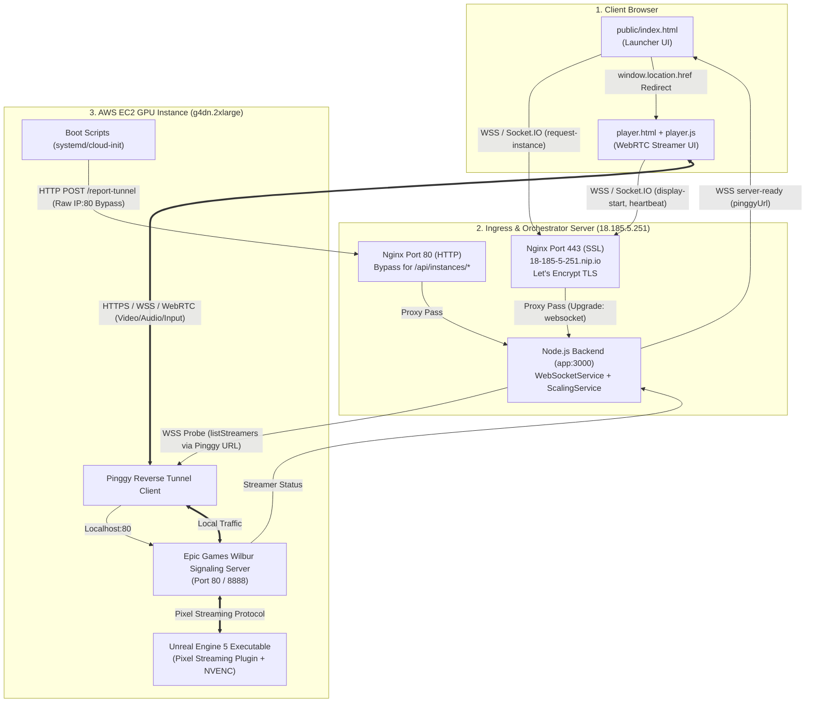
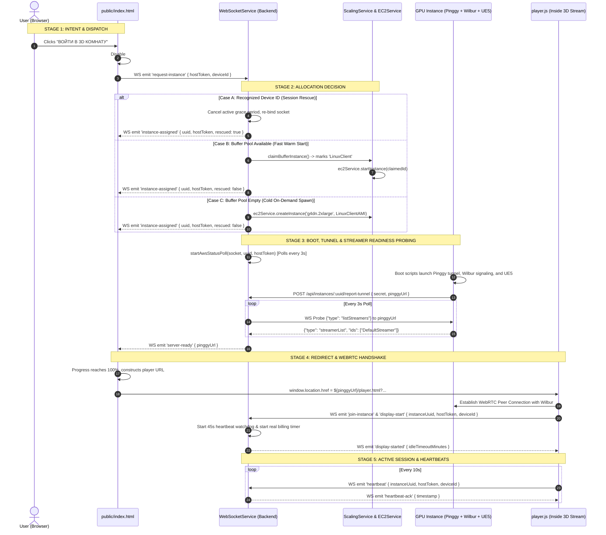

# FORENSIC USER-FLOW AUDIT REPORT: «ВОЙТИ В 3D КОМНАТУ» / «ENTER 3D ROOM»

**Target Flow**: User clicks **«ВОЙТИ В 3D КОМНАТУ»** on the Launcher $\longrightarrow$ Active 3D Pixel Streaming Session  
**Repository State**: `main` branch @ `4fbbc35490c2e3cfed71af2e837c789b44bd9b35`  
**Evaluation Scope**: Closed-testing functional correctness, networking path determination, state transitions, timing windows, reconnection resilience, and stuck-state edge cases.  
**Audit Mode**: Zero-assumption forensic code & configuration inspection.

---

## 1. THE ACTUAL NETWORKING & STREAMING PATH

*Determined strictly from executable source code and active configuration files.*



### Verified Networking Findings:
1. **Control & Signaling Ingress**:
   - Web clients connect via **HTTPS/WSS** to `https://18-185-5-251.nip.io` terminated by Nginx with Let's Encrypt certificates ([`nginx.conf:24-46`](file:///c:/Users/Admin/Desktop/Aleg/maximall-web/nginx.conf#L24-L46)).
   - In-guest EC2 startup scripts use **HTTP Port 80 bypass** (`location ~ ^/api/instances/`) to self-report tunnel URLs without SSL certificate errors ([`nginx.conf:6-15`](file:///c:/Users/Admin/Desktop/Aleg/maximall-web/nginx.conf#L6-L15)).
2. **Video & Pixel Streaming Plane**:
   - The active streaming path uses a **Pinggy Reverse Tunnel** (`*.pinggy.link` / `*.free.pinggy.link`).
   - The orchestrator backend **strictly requires** `instance.pinggyUrl` before issuing `server-ready` ([`src/services/websocketService.ts:439-503`](file:///c:/Users/Admin/Desktop/Aleg/maximall-web/src/services/websocketService.ts#L439-L503)). Direct IP connections (`http://ip:8000`) are used only as preliminary TCP reachability checks, but are never sent to the client as the final streaming target.
   - Wilbur serves `player.html` and negotiates WebRTC peer connections through the Pinggy tunnel.

---

## 2. COMPLETE USER FLOW: BUTTON CLICK TO ACTIVE 3D SESSION



---

## 3. IDENTIFIED BUGS, STUCK STATES & TIMING DEFECTS

During our forensic code inspection of this specific user flow, we identified **5 Critical & High Edge Cases** that can break the user experience during closed testing:

---

### Defect 1: Infinite Loading Screen on UE5 Boot Crash (Stuck at 79%)
- **Subsystem**: `src/services/websocketService.ts` (`startAwsStatusPoll`)
- **Lines**: [`src/services/websocketService.ts:373-526`](file:///c:/Users/Admin/Desktop/Aleg/maximall-web/src/services/websocketService.ts#L373-L526)
- **The Bug**:
  In `startAwsStatusPoll`, there is **no maximum retry limit or timeout counter**.
  If the EC2 instance boots and Pinggy successfully registers `/report-tunnel`, but Unreal Engine 5 crashes on startup (e.g. GPU shader compile error or out-of-memory error), Wilbur will answer the WebSocket probe with `{"type": "streamerList", "ids": []}`.
- **User Impact**:
  `isStreamerReady` returns `false` forever. The client's progress bar remains permanently frozen at **79% («Запуск 3D приложения...»)**. The user is never notified of the crash, and the EC2 instance remains running indefinitely, burning AWS budget.
- **Recommended Fix**: Add a 3-minute timeout (`checkCount > 60`) in `startAwsStatusPoll` that emits `instance-error: "3D application failed to start in time"` and terminates/recycles the instance.

---

### Defect 2: Heartbeat Watchdog Zombie Disconnect Defect
- **Subsystem**: `src/services/websocketService.ts` (`startHeartbeatMonitor` vs `handleHeartbeat`)
- **Lines**: [`src/services/websocketService.ts:633-658`](file:///c:/Users/Admin/Desktop/Aleg/maximall-web/src/services/websocketService.ts#L633-L658), [`src/services/websocketService.ts:804-818`](file:///c:/Users/Admin/Desktop/Aleg/maximall-web/src/services/websocketService.ts#L804-L818)
- **The Bug**:
  1. If a user on a mobile device or laptop switches tabs or experiences a 45-second network freeze, `startHeartbeatMonitor` clears the watchdog, sets `session.socketId = undefined`, and starts the 60-second grace period.
  2. When the user returns to the tab, `player.js` resumes sending `heartbeat` events.
  3. `handleHeartbeat` catches the heartbeat, updates `session.lastSeenAt`, and cancels the grace period.
  4. **However, `handleHeartbeat` does NOT restore `session.socketId = socket.id` and does NOT restart `startHeartbeatMonitor`!**
- **User Impact**:
  The session enters a zombie state where the server believes `socketId` is undefined. If the user subsequently closes the tab, `handleSocketDisconnect` fails to find the session, and the 15-second flicker window is never triggered. Teardown becomes delayed until the 30-second global garbage collection loop detects it.
- **Recommended Fix**: In `handleHeartbeat`, if `!session.socketId || session.socketId !== socket.id`, restore `session.socketId = socket.id` and invoke `this.startHeartbeatMonitor(socket.id, instanceUuid, hostToken)`.

---

### Defect 3: Multiple Tabs on Same Device Spawns Duplicate GPU Instances
- **Subsystem**: `src/services/websocketService.ts` (`handleRequestInstance`)
- **Lines**: [`src/services/websocketService.ts:174-205`](file:///c:/Users/Admin/Desktop/Aleg/maximall-web/src/services/websocketService.ts#L174-L205)
- **The Bug**:
  The device-rescue logic checks:
  ```typescript
  if (isRecognizedOwner) {
    const inGrace = this.timeTracker.hasGracePeriod(uuid);
    const noActiveSocket = !sessions.some(s => s.socketId);
    if (inGrace || noActiveSocket) {
      // Rescue session
    }
  }
  ```
  If a user has Tab 1 actively streaming (`hasActiveSocket === true`, `inGrace === false`) and opens Tab 2 on the same browser (sharing `localStorage.deviceId`), Tab 2's `request-instance` fails the `(inGrace || noActiveSocket)` condition.
- **User Impact**:
  The backend treats Tab 2 as a brand-new user and **spawns a second GPU instance**. Tab 2 overwrites the `hostToken` in `localStorage`. Tab 1 and Tab 2 now fight for token ownership.
- **Recommended Fix**: When `isRecognizedOwner` is true but the session is active, emit `session-found` or redirect the second tab to the existing running instance rather than spawning a duplicate instance.

---

### Defect 4: Buffer Wake-Up Failure Leaves Ghost Replenishment Task
- **Subsystem**: `src/services/scalingService.ts` vs `src/services/websocketService.ts`
- **Lines**: [`src/services/scalingService.ts:621-638`](file:///c:/Users/Admin/Desktop/Aleg/maximall-web/src/services/scalingService.ts#L621-L638), [`src/services/websocketService.ts:253-263`](file:///c:/Users/Admin/Desktop/Aleg/maximall-web/src/services/websocketService.ts#L253-L263)
- **The Bug**:
  In `claimBufferInstance()`, `setTimeout(() => this.reconcilePool(), 0)` is scheduled immediately upon marking the instance as claimed.
  If AWS EC2 `StartInstancesCommand` subsequently fails (e.g. temporary AWS API rate limit), `handleRequestInstance` rolls back `instance.assignedTo = 'Buffer'`, `instance.status = 'stopped'`.
- **User Impact**:
  `reconcilePool()` has already been dispatched. It sees the rolled-back buffer instance *plus* launches a new prewarm instance, creating an unwanted surplus GPU instance in the buffer pool.
- **Recommended Fix**: Only invoke `reconcilePool()` after `ec2Service.startInstance()` has resolved successfully.

---

### Defect 5: Unhandled Socket Disconnection During Pre-Redirect Loading UI
- **Subsystem**: `public/index.html` (`socket.on('connect_error')`)
- **Lines**: [`public/index.html:560-567`](file:///c:/Users/Admin/Desktop/Aleg/maximall-web/public/index.html#L560-L567)
- **The Bug**:
  If the client encounters a network drop while the loading screen is active, `connect_error` stops the progress simulation and displays `"Ошибка сервера. Проверьте интернет."`. However, `#launcher-ui` remains hidden (`display: none`), and `#btn` is not restored.
- **User Impact**:
  If the network recovers without a full page refresh, the user remains stuck on the error screen with no interactive button to retry.
- **Recommended Fix**: Add a «Повторить» (Retry) button on the error overlay that resets the launcher UI state.

---

## 4. ACTIVE LOGIC VS. LEGACY ARTIFACTS IN THIS FLOW

| Component / Feature | Active Execution Logic | Legacy / Dead Artifact |
| :--- | :--- | :--- |
| **Session Persistence** | Pure in-memory `DatabaseService.store` (`Map`) | Mongoose models in `src/data/models/` and `src/data/db.ts` |
| **Streaming Tunnel** | Pinggy reverse tunnel (`pinggyUrl`, `checkStreamerConnected`) | Static direct IP `http://ip:8000` direct connects |
| **Instance Quotas** | TimeTracker grace period (60s) & 60s minimum billing padding | `displayLimitHours` countdowns and quota cutoff timers (no-op stubs) |
| **Client Transport** | Socket.IO WebSocket transport with `localStorage.deviceId` | Session cookies on launcher (now only used on `/admin.html`) |

---

## 5. SUMMARY VERDICT FOR CLOSED TESTING

```text
========================================================================================
                      CLOSED TESTING FLOW VERDICT: FUNCTIONAL WITH RISKS
========================================================================================
```

### Key Takeaways:
1. **Normal Happy Path**: Works as expected. A user clicking the button will claim a buffer instance, receive status updates, and be redirected via the Pinggy tunnel to the active 3D stream within 5–15 seconds (buffer start) or 60–90 seconds (cold start).
2. **Reconnection & Refresh**: Resilient against accidental page refreshes via `sessionStorage` and `deviceId` matching.
3. **Primary Test Failure Risk**: The lack of a timeout in `startAwsStatusPoll` (Defect 1) means any crash in the Unreal Engine executable will trap test users on a 79% progress bar forever without automatic recovery.
