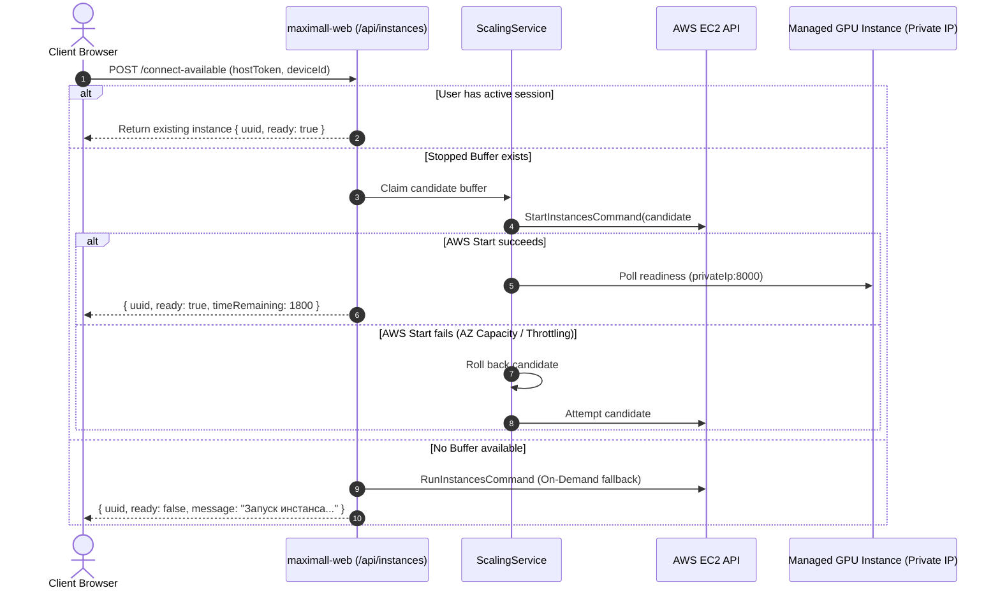

# Maximall Web Orchestrator: Master Architecture & Source of Truth

> **Repository**: `https://github.com/adavtyan815-art/maximall-web.git`  
> **Primary Role**: Web Application, Multi-Instance GPU Orchestrator, Hot-Standby Pool Manager, Reverse Proxy, and Session Control Backend.  
> **Orchestrator Host Environment**: AWS EC2 CPU instance (`t3.micro` / `t3.medium`, Ubuntu Linux with Node.js/Docker).  
> **Managed GPU Streaming Fleet**: AWS EC2 GPU instances (`g4dn.2xlarge` with NVIDIA Tesla T4 GPU, AMI `LinuxClientAMI`).  
> **Active Roadmap / Planned Sprints**: [`docs/todo.md`](todo.md).  

---

## Table of Contents
1. [System Overview & Purpose](#1-system-overview--purpose)
2. [Ecosystem Architecture & Inter-Project Contracts](#2-ecosystem-architecture--inter-project-contracts)
3. [Directory Structure & Core Modules](#3-directory-structure--core-modules)
4. [In-Memory Database & Settings Engine](#4-in-memory-database--settings-engine)
5. [Standby Pool State Machine & Dynamic Capacity Formulas](#5-standby-pool-state-machine--dynamic-capacity-formulas)
6. [Instance Allocation & Sequential Multi-Buffer Wake Lifecycle](#6-instance-allocation--sequential-multi-buffer-wake-lifecycle)
7. [Intra-VPC Private-IP Reverse Proxy Pipeline](#7-intra-vpc-private-ip-reverse-proxy-pipeline)
8. [Control Sessions, Watchdogs & Reconnect Safety](#8-control-sessions-watchdogs--reconnect-safety)
9. [Save/Load Subsystem & Level Data Contracts](#9-saveload-subsystem--level-data-contracts)
10. [REST API Specification](#10-rest-api-specification)
11. [Web Administration Dashboard & Configuration Controls](#11-web-administration-dashboard--configuration-controls)
12. [Production Environment, Terraform & AWS Infrastructure](#12-production-environment-terraform--aws-infrastructure)
13. [Build, Verification & Testing Workflow](#13-build-verification--testing-workflow)
14. [Protected Invariants (DO NOT BREAK THESE RULES)](#14-protected-invariants-do-not-break-these-rules)
15. [Roadmap & Planned Sprints](#15-roadmap--planned-sprints)

---

## 1. System Overview & Purpose

`maximall-web` is the central web and orchestration server for the MaxiMall 3D Web platform. Hosted on a standard AWS EC2 CPU instance (e.g. `t3.micro` / `t3.medium`), it orchestrates an elastic fleet of AWS EC2 GPU instances (`g4dn.2xlarge`) running Unreal Engine 5 (`awsTutorial`) and Epic Games Wilbur signaling (`maximall-pixel-config`).

```mermaid
flowchart TD
    subgraph Browser [Client Browser]
        UI[Landing Page / 3D Room Entry]
        Player[player.html / player.js WebRTC Viewport]
    end

    subgraph OrchestratorHost [maximall-web Host (EC2 t3.medium / Node.js)]
        API[Express REST API]
        Proxy[HTTP & WSS Reverse Proxy]
        Pool[ScalingService Standby Pool Loop]
        DB[(In-Memory Database & Settings)]
    end

    subgraph ManagedGPUFleet [Managed AWS GPU Fleet (eu-central-1)]
        EC2_Active[Active GPU Instance: g4dn.2xlarge (LinuxClientAMI)]
        EC2_Stopped[Stopped Buffer Pool: g4dn.2xlarge (LinuxClientAMI)]
    end

    UI -->|POST /api/instances/connect-available| API
    API -->|Allocate / Claim| Pool
    Pool -->|Start / Stop / Describe / Run| ManagedGPUFleet
    Player <-->|GET /instance/:uuid/player.html| Proxy
    Player <-->|WSS /instance/:uuid/ws| Proxy
    Proxy <-->|Private IP:8000| EC2_Active
    Player <-->|Socket.io Keepalive & Activity| API
```

---

## 2. Ecosystem Architecture & Inter-Project Contracts

The MaxiMall platform is composed of three distinct repositories with strict boundaries:

```
┌─────────────────────────────────────────────────────────────────────────────┐
│                              maximall-web                                   │
│  (Node.js / Express Orchestrator on Ubuntu AWS EC2 t3.medium or container)  │
└──────────────────────┬───────────────────────────────┬──────────────────────┘
                       │                               │
                       │ Reverse-proxies WebRTC        │ Exchanges Save/Load
                       │ signaling & player assets     │ REST JSON payloads
                       ▼                               ▼
┌──────────────────────────────────────────────┐ ┌────────────────────────────┐
│            maximall-pixel-config             │ │        awsTutorial         │
│  (Wilbur Signaling Server & Frontend Player) │ │   (Unreal Engine 5 C++)    │
│  • Runs on AWS GPU Instance (`/home/ssm-user`)│ │  • Packaged for Linux on   │
│  • Listens on port 8000 (HTTP/WS)            │ │    PC2 (UE 5.6)            │
│  • Connects to UE5 streamer on port 8888     │ │  • Runs on GPU instance    │
└──────────────────────────────────────────────┘ └────────────────────────────┘
```

### 2.1 Interface with `maximall-pixel-config`
- **Role**: Epic Games Pixel Streaming signaling infrastructure and compiled web player application.
- **Location**: Deployed at `/home/ssm-user/web/` on the AWS GPU instance AMI (`LinuxClientAMI`).
- **Signaling Endpoint**: Wilbur runs on port `8000`. `maximall-web` reverse-proxies HTTP asset requests (`/instance/:uuid/*`) and WebSocket signaling upgrades (`/instance/:uuid/ws`) directly to `http://${privateIp}:8000/`.
- **Socket.io Control Channel**: `player.ts` dynamically connects back to `maximall-web` to emit `display-start`, `heartbeat` (every 10s), and `user-activity`. `maximall-web` emits `instance-stopping` when recycling the instance.

### 2.2 Interface with `awsTutorial` (Unreal Engine 5)
- **Role**: Functional 3D interactive application containing the C++ showroom, room constructor, camera navigation, and booth management logic.
- **Packaging & Builds**: Official production Client/Server builds are packaged on **PC2** using Unreal Engine 5.6 into Linux binaries deployed on the GPU instance AMI.
- **Save/Load REST Calls**: Unreal Engine's `UUserSaveGame` and web subsystem make HTTP calls to `maximall-web`:
  - `GET /api/saves?user=<username>`: Fetches user room designs.
  - `POST /api/saves`: Uploads serialized furniture coordinates, booth states, and Base64 preview screenshots.

---

## 3. Directory Structure & Core Modules

```
maximall-web/
├── docs/
│   ├── CLAUDE.md                    # Concise AI Agent operational guide
│   ├── MAXIMALL_WEB_GUIDE.md        # THIS MASTER ARCHITECTURE GUIDE
│   └── todo.md                      # Active planned sprint tasks & edge cases
├── public/                          # Static Web Frontend
│   ├── index.html                   # Main user entry & room selection page
│   ├── admin.html                   # Live administrator dashboard
│   ├── login.html                   # Admin authentication portal
│   └── assets/                      # Styles, scripts (main.js), icons, and images
├── src/                             # Backend TypeScript Source Code
│   ├── app.ts                       # Express application setup, routes & reverse proxy
│   ├── server.ts                    # HTTP server, WebSocket proxy upgrade & bootstrap
│   ├── config/                      # Environment variables & constants
│   ├── data/
│   │   ├── db.ts                    # In-memory storage collections
│   │   ├── models/                  # InstanceModel, SettingsModel interfaces
│   │   └── saves/                   # User-uploaded JSON room designs & booth layouts
│   ├── services/
│   │   ├── databaseService.ts       # In-memory instance store CRUD & query helpers
│   │   ├── ec2Service.ts            # AWS SDK EC2 client (Describe, Start, Stop, Run, Terminate)
│   │   ├── scalingService.ts        # Standby pool state machine & prewarm loop
│   │   ├── settingsService.ts       # Runtime pool targets, timeouts & cost tracking
│   │   ├── timeTrackerService.ts    # User session duration & billing accumulation
│   │   └── websocketService.ts      # Socket.io connection manager, watchdog & grace period
│   └── types/                       # TypeScript interfaces (API, Instance, WebSocket)
├── terraform/                       # Infrastructure as Code for deploying orchestrator
├── package.json                     # Node.js dependencies & scripts
└── tsconfig.json                    # TypeScript compiler options
```

---

## 4. In-Memory Database & Settings Engine

### 4.1 Database Design (`DatabaseService` & `db.ts`)
- **Zero External DB Dependencies**: Uses fast in-memory Maps for instance records, eliminating MongoDB/Redis connection overhead.
- **Instance State Record (`InstanceModel`)**:
  ```typescript
  interface InstanceModel {
    instanceId: string;           // AWS EC2 instance ID (e.g. 'i-0abcd1234ef567890')
    uuid: string;                 // Internal unique identifier
    publicIp?: string;            // AWS Elastic / Public IP
    privateIp?: string;           // Intra-VPC Private IP (172.31.x.x)
    status: InstanceStatus;       // 'running' | 'stopped' | 'stopping' | 'pending' | 'shutting-down'
    assignedTo: string;           // 'Buffer' | 'Prewarm' | 'OnDemand-XXXXXX' | '<username>'
    allocatedAt?: Date;           // Timestamp when user claimed the session
    realTimeUsedSeconds: number;  // Seconds the EC2 instance has spent powered on
    displayTimeUsedSeconds: number; // Seconds user was actively connected
    activeSessions: number;       // Current connected browser tab count
    gracePeriodTimer?: any;       // Active 60s disconnect watchdog timer
    disconnectTime?: Date;        // Timestamp of last browser disconnection
  }
  ```

### 4.2 Settings Management (`SettingsService`)
- Configures dynamic runtime operational thresholds without restarting the server:
  - `minBufferTarget`: Baseline stopped GPU instances ready for instant wake (default: 3).
  - `extraBufferTarget`: Dynamic extra boost capacity (default: 2).
  - `maxRunningInstances`: Hard ceiling on concurrent running GPU instances (default: 10).
  - `prewarmPollInterval`: Interval for the scaling loop (default: 60s).
  - `hourlyCostPerInstance`: AWS hourly run rate for cost tracking (default: \$1.20/hr).

---

## 5. Standby Pool State Machine & Dynamic Capacity Formulas

To provide fast startup times while minimizing AWS GPU idle costs, `ScalingService` maintains a pre-warmed pool of stopped EC2 GPU instances:

```
                  ┌───────────────────────────────┐
                  │          NEW DEMAND           │
                  └───────────────┬───────────────┘
                                  │
          ┌───────────────────────┴───────────────────────┐
          ▼                                               ▼
┌──────────────────┐                            ┌──────────────────┐
│  Stopped Buffer  │ (Wakes in 25-40s)          │ Launch On-Demand │ (Launches in 60-90s)
│  g4dn.2xlarge    │                            │   g4dn.2xlarge   │
└─────────┬────────┘                            └─────────┬────────┘
          │                                               │
          └───────────────────────┬───────────────────────┘
                                  ▼
                    ┌───────────────────────────┐
                    │    Running / Active User  │
                    └─────────────┬─────────────┘
                                  │
                   (User Disconnects + 60s Grace)
                                  │
                                  ▼
                    ┌───────────────────────────┐
                    │  recycleInstanceToBuffer  │
                    │  (Sends AWS Stop Command) │
                    └─────────────┬─────────────┘
                                  │
                                  ▼
                    ┌───────────────────────────┐
                    │   Returned to 'Buffer'    │
                    │   (Stopped GPU Pool)      │
                    └───────────────────────────┘
```

### 5.1 Dynamic Capacity Invariant Formulas:
$$\text{MaxAllowed} = \max(0, \text{Base} + \text{Extra} - \text{Active})$$
$$\text{EffectiveBuffer} = \text{Ready (stopped Buffer)} + \text{Recycling} + \text{Prewarming}$$
$$\text{Deficit} = \max(0, \text{Base} - \text{EffectiveBuffer})$$
$$\text{Surplus} = \max(0, \text{EffectiveBuffer} - \text{MaxAllowed})$$

- **Deficit Handling**: When $\text{Deficit} > 0$, the scaling loop launches a new on-demand GPU instance tagged `Prewarm`, validates Wilbur readiness over private IP, stops the instance, and assigns it to `assignedTo = "Buffer"`.
- **Surplus Handling**: When $\text{Surplus} > 0$, excess instances are terminated LIFO from stopped buffers only. In-flight prewarms are never prematurely killed.

---

## 6. Instance Allocation & Sequential Multi-Buffer Wake Lifecycle

When a user clicks *"Enter 3D Room"* (`POST /api/instances/connect-available`):



---

## 7. Intra-VPC Private-IP Reverse Proxy Pipeline

All browser communication to GPU instances flows securely through `maximall-web`'s reverse proxy:

### 7.1 HTTP Player Assets Proxy (`GET /instance/:uuid/*`)
- The browser requests `http://<domain>/instance/<uuid>/player.html`.
- `app.ts` looks up the instance's `privateIp` in the in-memory database.
- Streams the asset response directly from `http://${privateIp}:8000/${path}`.
- Normalizes HTTP headers, setting `host: ${privateIp}` to comply with Wilbur host validation.

### 7.2 WebSocket Signaling Proxy (`WSS /instance/:uuid/ws`)
- Handled during HTTP server upgrade (`server.ts`).
- Establishes a direct TCP socket between `maximall-web` and `ws://${privateIp}:8000/`.
- **FIFO Message Buffer**: Maintains a 500-message buffer during connection establishment, preventing dropped SDP offers/answers when WebSocket handshakes occur during rapid page reloads.

---

## 8. Control Sessions, Watchdogs & Reconnect Safety

### 8.1 Multi-Tab Protection
- One active streaming instance per physical device (`deviceId`).
- If a user opens a second tab while an active session exists, the backend emits `session-in-use` (*"3D-комната уже открыта в другой вкладке"*), preventing duplicate billing.

### 8.2 Disconnection Grace Period (60 Seconds)
- When a user closes their browser tab or experiences network interruption, `WebSocketService` initiates a 60-second grace period (`startGracePeriod(uuid)`).
- If the user reopens the page or reconnects within 60 seconds (providing matching `hostToken`), the grace period is cancelled immediately and the session resumes seamlessly.
- If 60 seconds elapse with zero connected tabs, `recycleInstanceToBuffer(uuid)` issues AWS `StopInstancesCommand` and returns the instance to the stopped buffer pool.

---

## 9. Save/Load Subsystem & Level Data Contracts

User room designs and customized booth configurations are persisted as JSON files under `src/data/saves/`:

### 9.1 Save File Structure (`src/data/saves/<username>.json`)
```json
{
  "version": 1,
  "user": "artur.davtyan",
  "roomData": {
    "roomId": "modern_hall",
    "objects": [
      { "id": "sofa_01", "x": 120.5, "y": -450.0, "z": 0.0, "yaw": 90.0 }
    ],
    "boothStates": [
      { "boothId": "booth_3", "active": true, "theme": "marble" }
    ]
  },
  "screenshotBase64": "data:image/jpeg;base64,...",
  "updatedAt": "2026-08-21T12:00:00.000Z"
}
```

---

## 10. REST API Specification

### 10.1 Public User Endpoints
| Endpoint | Method | Description |
|---|---|---|
| `/api/instances/connect-available` | `POST` | Allocates, wakes, or starts a GPU instance for the user session. |
| `/api/instances/:uuid/status` | `GET` | Queries live instance readiness, state, and IP address. |
| `/api/saves` | `GET` | Retrieves saved room layouts for a given user (`?user=<username>`). |
| `/api/saves` | `POST` | Saves or overwrites a room design layout with optional screenshot. |
| `/api/saves/:id` | `DELETE` | Removes a saved design from disk. |

### 10.2 Admin Management Endpoints (Session Authenticated)
| Endpoint | Method | Description |
|---|---|---|
| `/api/admin/login` | `POST` | Authenticates administrator session. |
| `/api/admin/logout` | `POST` | Invalidates administrator session. |
| `/api/admin/instances` | `GET` | Lists all instances in pool, runtime metrics, and active allocations. |
| `/api/admin/settings` | `GET` / `POST` | Retrieves or updates dynamic pool limits and cost constants. |
| `/api/admin/instances/:uuid/start` | `POST` | Manually powers on a stopped instance. |
| `/api/admin/instances/:uuid/stop` | `POST` | Manually stops a running instance. |
| `/api/admin/instances/:uuid/recycle` | `POST` | Manually recycles an active instance back to `Buffer`. |
| `/api/admin/instances/:uuid/terminate` | `POST` | Terminates an instance on AWS EC2. |

---

## 11. Web Administration Dashboard & Configuration Controls

The built-in web portal at `/admin.html` provides real-time monitoring and management:
- **Live Fleet Table**: Displays Instance ID, IP addresses, AWS Status, Pool Assignment (`Buffer`/`Prewarm`/User), and live Real-time vs. Display-time counters.
- **Dynamic Configuration Sliders**: Adjust `minBufferTarget`, `extraBufferTarget`, and `maxRunningInstances` on the fly without server restarts.
- **Direct Lifecycle Controls**: Trigger manual Start, Stop, Recycle, or Terminate commands on individual instances.

---

## 12. Production Environment, Terraform & AWS Infrastructure

- **Orchestrator Host (`aws_instance.maximall_web`)**:
  - Runs on a standard AWS EC2 CPU instance (`t3.micro` / `t3.medium`, Ubuntu Linux 22.04 LTS).
  - Deployed in the public subnet of `eu-central-1` (Frankfurt).
  - Runs Docker & Docker Compose to host the `maximall-web` Node.js server.
- **Managed GPU Streaming Fleet**:
  - `g4dn.2xlarge` instances with NVIDIA Tesla T4 GPUs running `LinuxClientAMI`.
  - Discovered automatically by EC2 tag (`Name=LinuxClient`).
- **Security Groups**:
  - `pixel_streaming_sg`: Allows inbound port 80/443 to the orchestrator, and intra-VPC port 8000 from the orchestrator to GPU instances.
- **Terraform Directory (`terraform/`)**: Contains `main.tf`, `variables.tf`, and `outputs.tf` for deploying the orchestrator host instance.

---

## 13. Build, Verification & Testing Workflow

### 13.1 Build Commands
```bash
# Clean install dependencies
npm install

# Compile TypeScript
npm run build

# Run Development Server
npm run dev

# Run Production Server
npm start
```

### 13.2 Post-Modification Verification Checklist
- [ ] `npm run build` completes with exit code 0 and zero TypeScript diagnostic errors.
- [ ] Verify private IP fallback routing (`inst.privateIp || inst.publicIp`).
- [ ] Confirm `recycleInstanceToBuffer` is invoked on session expiration instead of terminate.
- [ ] Ensure all user-facing banners and error modals remain in clean Russian.

---

## 14. Protected Invariants (DO NOT BREAK THESE RULES)

> [!IMPORTANT]
> ### BACKEND INTEGRITY RULES
> 1. **Private IP Routing**: Never bypass `privateIp` when communicating with GPU instances within the AWS VPC.
> 2. **Graceful Recycling**: Never issue `TerminateInstancesCommand` on user session disconnect. Always call `recycleInstanceToBuffer` to power off and preserve instances in the buffer pool.
> 3. **Base/Extra Pool Invariants**: Always respect dynamic capacity formulas. Extra instances are consumed by active users without spawning replacement prewarms.
> 4. **Multi-Tab Single-Session Enforcement**: Enforce one active stream per `deviceId`.
> 5. **Preserve Russian User Dialogs**: All user-facing error banners and notifications must remain in Russian.

---

## 15. Roadmap & Planned Sprints

For upcoming sprint tasks, billing persistence improvements, and edge-case watchdog implementations, refer to the active tracking document:
👉 **[`docs/todo.md`](todo.md)**

---
*Document Version: 1.1.0 — Canonical Source of Truth for maximall-web*
