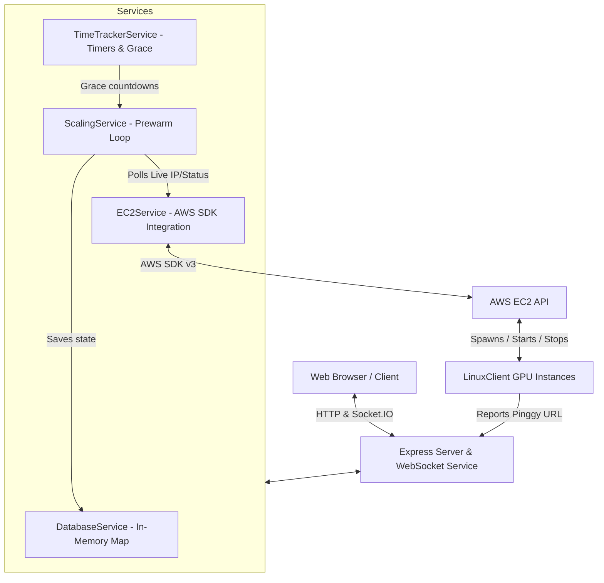

# System Architecture

This document describes the high-level architecture of the Maximall web application. The platform manages the dynamic lifecycle of Unreal Engine GPU pixel streaming instances on AWS EC2, maintaining a hot-standby pool of pre-warmed instances to deliver instant connection times (<2 seconds) for incoming users.

---

## 1. High-Level Component Layout

The system is built as a single-process Node.js TypeScript application. Below is a layout of the core modules and how they interact:

---

## 2. Core Service Modules

### A. Express Server & WebSocket Service (`app.ts` / `websocketService.ts`)
- **HTTP REST Endpoints**: Serve the admin dashboard payload (`/api/admin/dashboard`), handle manual operations (Instance Sync, Start, Stop, Terminate, Abort Prewarm), and support authentication (`/api/admin/login`/`logout`). Also exposes public endpoints for client redirects (`/api/instances/connect-available`).
- **Socket.IO Event Handlers**: Connect clients, check active streamers via Pinggy tunnels, wake up claimed buffer instances, protect active sessions from flicker (15s reconnect window), and clean up instances after user exit (60s grace period).

### B. Scaling Service (`scalingService.ts`)
- **Pre-Warm Loop**: Periodically audits the pool (every 60s). It calculates pool deficit relative to target `BUFFER_SIZE` (3 ready stopped instances) and launches replacement prewarm instances.
- **Stage Machine**: Sequentially transitions each prewarm instance through 5 states:
  1. **BOOT**: Wait for AWS state to be `running`.
  2. **TUNNEL**: Wait for the startup script on the instance to report its Pinggy tunnel URL to `/api/instances/report-tunnel`.
  3. **SIGNAL**: Wait for the signaling server process on the instance to start.
  4. **STREAMER**: Perform a WebSocket handshake with the signaling server to ensure the UE5 streamer connects.
  5. **STOP**: Safely stop the instance so it rests in the green Buffer Pool, ready for sub-second start times.

### C. EC2 Service (`ec2Service.ts`)
- **AWS Integration**: Interacts directly with the AWS EC2 client using the SDK.
- **Commands**: Wraps EC2 actions (`StartInstancesCommand`, `StopInstancesCommand`, `TerminateInstancesCommand`, `DescribeInstancesCommand`, `DescribeImagesCommand`, and `RunInstancesCommand`).
- **AMI Discovery**: Dynamically resolves AMI Image ID by tag or name prefix to ensure elasticity.

### D. Time Tracker Service (`timeTrackerService.ts`)
- **Active Timers**: Measures real time used in active sessions for the dashboard metrics.
- **Grace Period Timer**: Coordinates the 60-second grace shutdown timer when a user session's WebSockets disconnect. If the viewer fails to reconnect, it triggers the scaling service to terminate the instance.

### E. Database Service (`databaseService.ts`)
- **In-Memory Store**: Pure in-memory Map structure tracking instance configurations, states, active sessions, and usage metrics. All states are intentionally reset on server restart, triggering automatic resynchronization with AWS.
