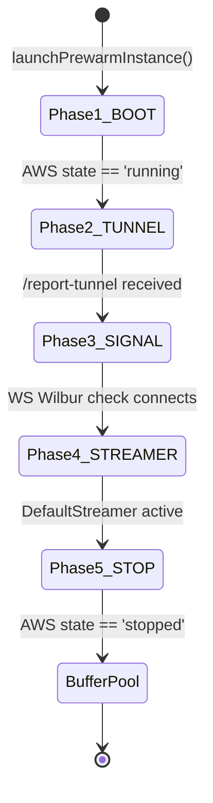
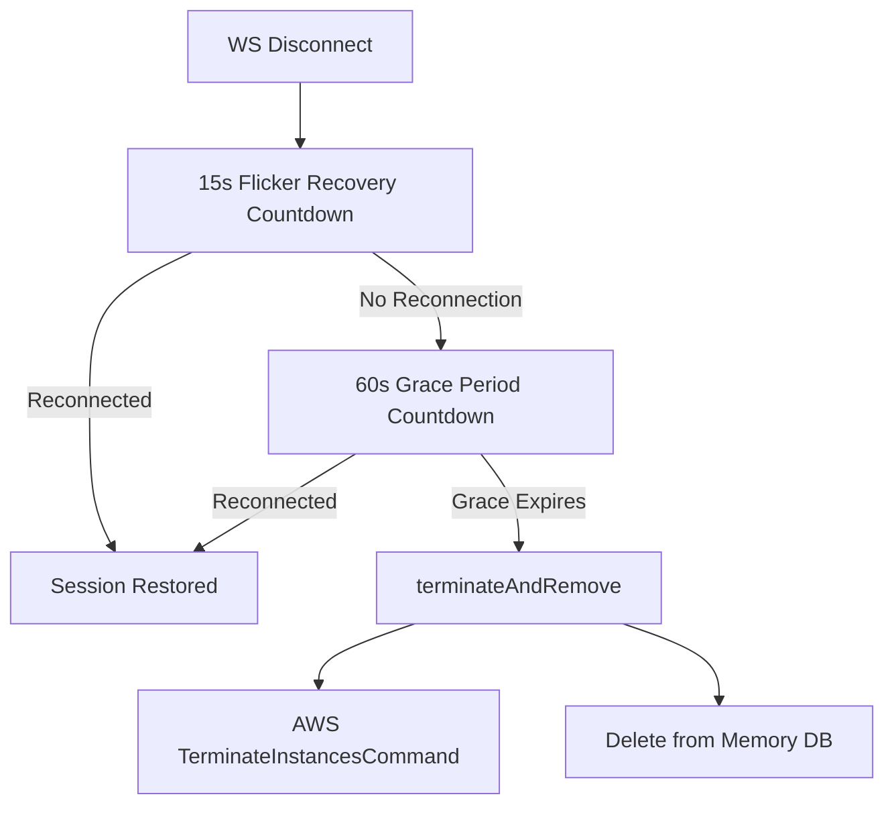
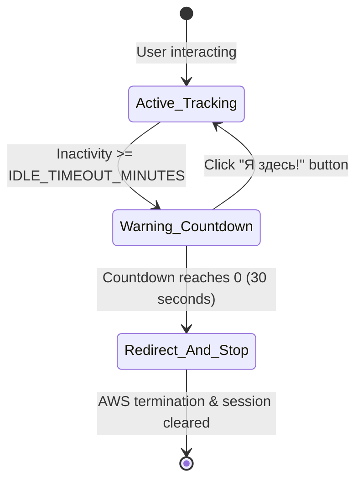

# Prewarm, Claiming, Teardown & Inactivity Lifecycles

This document describes the lifecycle state-machine of the EC2 instances, detailing the pre-warming phases, pool claiming mechanics, replenishment logic, user disconnection cleanup, and idle/disconnection timeout flows.

---

## 1. The Prewarm State Machine

The backend maintains a standby pool of exactly 3 pre-warmed, stopped GPU instances to bypass the standard 2-minute EC2 boot latency. Each prewarm instance transitions sequentially through 5 distinct setup phases, managed asynchronously in `ScalingService`:

### Phase Details
- **Phase 1 (BOOT)**: Wait for AWS to transition the newly created instance from `pending` to `running`. Once `running`, the public IP address is retrieved.
- **Phase 2 (TUNNEL)**: Wait for the startup script inside the instance to report its Pinggy tunnel URL via the `/api/instances/:uuid/report-tunnel` endpoint.
- **Phase 3 (SIGNAL)**: Verify that the Wilbur signaling server process is active by performing a WebSocket handshake.
- **Phase 4 (STREAMER)**: Verify that the Unreal Engine WebRTC streamer process has booted and registered itself to the signaling server (checked via WebSocket `listStreamers` command).
- **Phase 5 (STOP)**: Gracefully stop the verified prewarm instance via AWS `StopInstancesCommand`. Once confirmed as `stopped`, its status role is updated to `assignedTo = "Buffer"`.

---

## 2. Pool Replenishment Audit

The background scaling loop runs every 60 seconds. It audits the pool size as follows:
1. **Count Buffer**: Counts all database instances where `assignedTo === "Buffer"` and `status === "stopped"`.
2. **Count Prewarms**: Counts all database instances where `assignedTo === "Prewarm"` or that are actively undergoing prewarm phase transitions in memory.
3. **Calculate Deficit**:
   $$\text{Deficit} = 3 - \text{Buffer Count} - \text{Prewarm Count}$$
4. **Trigger Launch**: If $\text{Deficit} > 0$, the scaling service concurrently launches new prewarm instances (one per deficit unit) to replenish the standby pool.

---

## 3. Buffer Claiming Mechanics

When a user triggers `/api/instances/connect-available`:
1. **Evaluation**: Checks the registry for any instance with `assignedTo === "Buffer"` and `status === "stopped"`.
2. **Buffer Claim (Success)**:
   - Claims the instance by reassigning its pool role to `assignedTo = "OnDemand-xxxxxx"` and setting its status to `pending`.
   - Triggers an AWS `StartInstancesCommand` to wake it up in the background.
   - Instantly returns the startup configuration to the client.
   - Triggers the replenishment loop in the background to spawn a new prewarm instance.
3. **Fallback (Empty Buffer)**:
   - If no ready stopped buffer instances exist, the system spawns a brand new on-demand instance (`assignedTo = "OnDemand-xxxxxx"`, `status = "pending"`).

---

## 4. User Disconnect & Teardown Flow

When a user closes their browser tab or loses connection, the WebSocket connection drops, triggering the teardown sequence:

1. **Flicker Recovery (15s)**: Pauses for 15 seconds to allow for network switching or page refreshes. If the client reconnects with the same session token, the timer is canceled.
2. **Grace Period (60s)**: If the client does not reconnect within 15 seconds, the instance enters the Grace Period. If no user reconnects before 60 seconds expire, the instance teardown is executed.
3. **Teardown**: Calls `terminateAndRemove(instanceId)`, issuing an AWS `TerminateInstancesCommand` to terminate the EC2 instance and deleting it from the in-memory database registry.

---

## 5. User Inactivity (Idle Timeout) Flow

To prevent GPU instances from running indefinitely when users leave their browser tabs open without interacting, the system enforces an Idle Timeout mechanism:

1. **Active Tracking**: The backend monitors client presence. Every time the user interacts with the page (mouse move, click, key down, touch start), a `user-activity` message is sent via WebSockets to reset the backend timer.
2. **Warning Countdown (30s)**: If no activity is received for `IDLE_TIMEOUT_MINUTES` (configured in `.env`), the backend emits an `idle-warning` event to the client. The client displays a glassmorphic modal with a 30-second countdown.
3. **Modal Reset**: The user must explicitly click the **"Я здесь!"** button to close the modal and reset the timer. Normal movements/keystrokes are ignored during the warning state.
4. **Shutdown Trigger**: If the 30-second countdown expires without a response, the backend emits `idle-timeout`, clears the client session, and triggers `terminateAndRemove()` to shut down the EC2 instance.

---

## 6. Streamer Disconnection Webhook Flow

If the Unreal Engine application crashes or is closed directly on the host machine:
1. The signaling server's `streamerRegistry` detects that the connection to `DefaultStreamer` was lost.
2. The signaling server POSTs a notification to the orchestrator's `/api/instances/:uuid/streamer-disconnected` webhook endpoint.
3. Upon receiving this webhook, the orchestrator verifies the shared secret and immediately initiates the 60-second grace period countdown.
4. If the streamer does not reconnect within the grace period, the backend issues an AWS `TerminateInstancesCommand` to tear down the instance.
