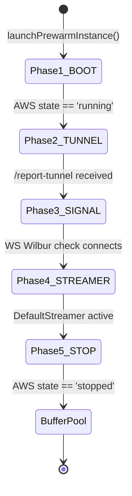

# Prewarm, Claiming & Teardown Lifecycles

This document describes the lifecycle state-machine of the EC2 instances, detailing the pre-warming phases, pool claiming mechanics, replenishment logic, and user disconnection cleanup flows.

---

## 1. The Prewarm State Machine

The backend maintains a standby pool of exactly 3 pre-warmed, stopped GPU instances to bypass the standard 2-minute EC2 boot latency. Each prewarm instance transitions sequentially through 5 distinct setup phases, managed asynchronously in `ScalingService`:



### Phase Details

#### Phase 1: BOOT
- **Task**: Wait for AWS to transition the newly created instance from `pending` to `running`.
- **Logic**: Polls `ec2Service.getInstanceStatus` every 15 seconds (up to 60 times). Once the state becomes `running`, the public IP address is retrieved and saved, and the instance moves to Phase 2.

#### Phase 2: TUNNEL
- **Task**: Wait for the startup script inside the instance to report its Pinggy tunnel URL.
- **Logic**: Polls the in-memory database configuration every 15 seconds (up to 40 times) to check if the instance called `/api/instances/report-tunnel`. Once the Pinggy URL is present, it transitions to Phase 3.

#### Phase 3: SIGNAL
- **Task**: Verify that the Wilbur signaling server process is active.
- **Logic**: Performs a WebSocket handshake check against the instance's Pinggy URL. If the server replies or is reachable, it transitions to Phase 4.

#### Phase 4: STREAMER
- **Task**: Verify that the Unreal Engine WebRTC streamer process has successfully booted and registered itself to Wilbur.
- **Logic**: Opens a WebSocket connection directly to the Pinggy URL and transmits a JSON query: `{"type": "listStreamers"}`. If the signaling server responds with a streamer list containing active streamer IDs (e.g., `{"type":"streamerList","ids":["DefaultStreamer"]}`), the prewarm verification is marked complete and it moves to Phase 5.

#### Phase 5: STOP
- **Task**: Gracefully stop the verified prewarm instance.
- **Logic**: Issues an AWS `StopInstancesCommand` to transition the instance to a `stopped` state. Once confirmed as `stopped` by AWS status checks, its pool role is updated to `assignedTo = "Buffer"` and its status is saved as `stopped`. It is now resting in the Buffer pool.

---

## 2. Pool Replenishment Audit

The background scaling loop runs every 60 seconds (or is triggered manually on Sync/Login). It audits the pool size as follows:

1. **Count Buffer**: Counts all database instances where `assignedTo === "Buffer"` and `status === "stopped"`.
2. **Count Prewarms**: Counts all database instances where `assignedTo === "Prewarm"` or that are actively undergoing prewarm phase transitions in memory.
3. **Calculate Deficit**:
   $$\text{Deficit} = 3 - \text{Buffer Count} - \text{Prewarm Count}$$
4. **Trigger Launch**: If $\text{Deficit} > 0$, the scaling service concurrently launches new prewarm instances (one per deficit unit) to replenish the standby pool.

---

## 3. Buffer Claiming Mechanics

When a user triggers `/api/instances/connect-available` or sends a WebSocket connection request:

1. **Evaluation**: Checks the registry for any instance with `assignedTo === "Buffer"` and `status === "stopped"`.
2. **Buffer Claim (Success)**:
   - Claims the instance by reassigning its pool role to `assignedTo = "OnDemand-xxxxxx"` and setting its status to `pending`.
   - Triggers an asynchronous AWS `StartInstancesCommand` to wake it up in the background.
   - Instantly returns the startup configuration to the client.
   - Since the buffer size has decreased by 1, the deficit becomes 1, immediately triggering the replenishment loop in the background to spawn a new prewarm instance.
3. **Fallback (Empty Buffer)**:
   - If no ready stopped buffer instances exist, the system spawns a brand new on-demand instance (`assignedTo = "OnDemand-xxxxxx"`, `status = "pending"`).

---

## 4. User Disconnect & Teardown Flow

When a user closes their browser tab or loses connection, the WebSocket connection drops, triggering the teardown sequence:

```mermaid
graph TD
    Disconnect[WS Disconnect] --> Flicker[15s Flicker Recovery Countdown]
    Flicker -->|Reconnected| Active[Session Restored]
    Flicker -->|No Reconnection| Grace[60s Grace Period Countdown]
    Grace -->|Reconnected| Active
    Grace -->|Grace Expires| Teardown[terminateAndRemove()]
    Teardown --> Terminate[AWS TerminateInstancesCommand]
    Teardown --> Delete[Delete from Memory DB]
```

1. **Flicker Recovery (15s)**: Pauses for 15 seconds to allow for network switching or page refreshes. If the client reconnects with the same session token, the timer is canceled.
2. **Grace Period (60s)**: If the client does not reconnect within 15 seconds, the instance enters the Grace Period. If no user reconnects before 60 seconds expire, the instance teardown is executed.
3. **Teardown**: Calls `terminateAndRemove(instanceId)`, issuing an AWS `TerminateInstancesCommand` to terminate the EC2 instance and deleting it from the in-memory database registry.
