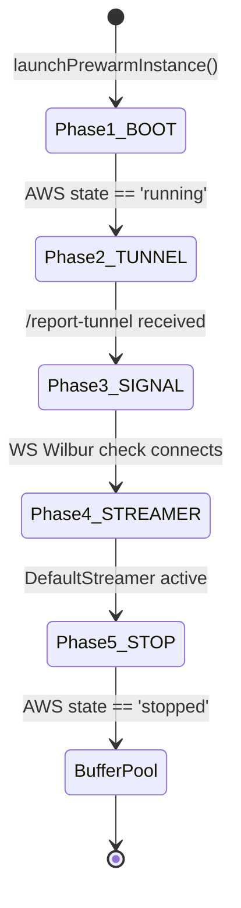
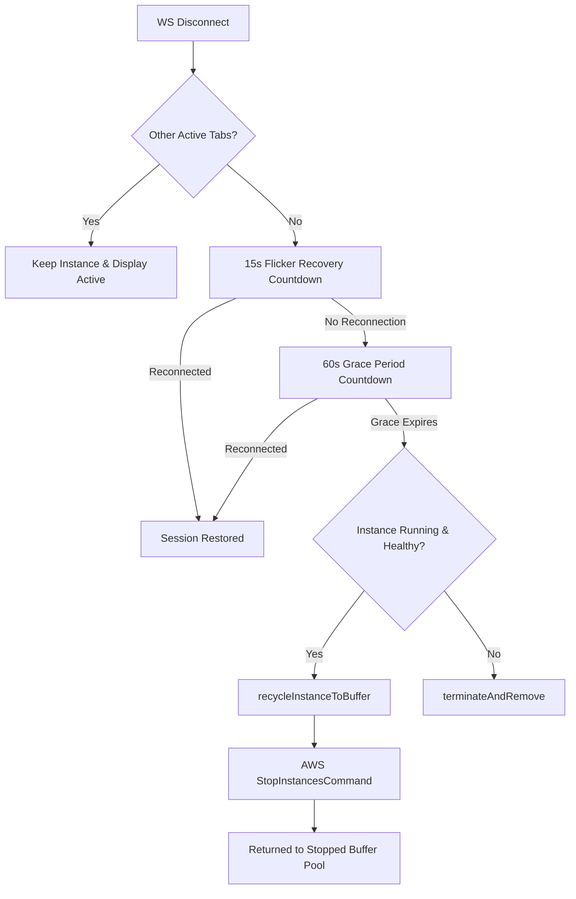

# Prewarm, Claiming, Teardown & Inactivity Lifecycles

This document describes the lifecycle state-machine of the EC2 instances, detailing the pre-warming phases, pool claiming mechanics, replenishment logic, user disconnection cleanup, and idle/disconnection timeout flows.

---

## 1. The Prewarm State Machine

The backend maintains a standby pool of pre-warmed, stopped GPU instances to bypass the standard 2-minute EC2 boot latency. The target pool size is **admin-controlled** via the Dashboard's **"Применить и выровнять"** button (default: `0` on startup — fully passive, no instances launched automatically). Each prewarm instance transitions sequentially through 5 distinct setup phases, managed asynchronously in `ScalingService`:

```mermaid
stateDiagram-v2
    [*] --> Phase1_BOOT : launchPrewarmInstance()
    Phase1_BOOT --> Phase2_TUNNEL : AWS state == 'running'
    Phase2_TUNNEL --> Phase3_SIGNAL : /report-tunnel received
    Phase3_SIGNAL --> Phase4_STREAMER : WS Wilbur check connects
    Phase4_STREAMER --> Phase5_STOP : DefaultStreamer active
    Phase5_STOP --> BufferPool : AWS state == 'stopped'
    BufferPool --> [*]
```

### Phase Details
- **Phase 1 (BOOT)**: Wait for AWS to transition the newly created instance from `pending` to `running`. Once `running`, the public IP address is retrieved.
- **Phase 2 (TUNNEL)**: Wait for the startup script inside the instance to report its Pinggy tunnel URL via the `/api/instances/:uuid/report-tunnel` endpoint.
- **Phase 3 (SIGNAL)**: Verify that the Wilbur signaling server process is active by performing a WebSocket handshake.
- **Phase 4 (STREAMER)**: Verify that the Unreal Engine WebRTC streamer process has booted and registered itself to the signaling server (checked via WebSocket `listStreamers` command).
- **Phase 5 (STOP)**: Gracefully stop the verified prewarm instance via AWS `StopInstancesCommand`. Once confirmed as `stopped`, its status role is updated to `assignedTo = "Buffer"`.

---

## 2. Pool Replenishment Audit

The background scaling loop (`reconcilePool`) runs every 60 seconds and follows a **5-step pipeline**:

1. **Read Dynamic Threshold**: Reads `minBufferTarget` from `SettingsService`. Default on server startup is **`0`** (passive mode — the system launches nothing automatically). The admin sets the effective floor via the **"Применить и выровнять"** button on the Dashboard. Applies on the next loop tick without a restart.

2. **AWS Sync + Ghost Purge (lightweight)**: Calls `DescribeInstances` for `Name=LinuxClient` instances. Two actions:
   - **Absorb**: Any `stopped` instance found in AWS that is **not yet tracked** in the DB is upserted as `assignedTo = "Buffer"`.
   - **Purge**: Any DB record with `assignedTo = "Buffer"` whose `instanceId` is **absent** from the AWS discovery response is immediately deleted from DB. This prevents externally-terminated instances (deleted via AWS Console or dashboard Delete button) from being counted as phantom buffer slots, which would cause the auto-loop guard to see `bufferCount >= minBufferTarget` against ghost records and never launch replacements.

3. **Count Pool State**: After sync + purge, counts:
   - `bufferCount` = DB instances where `assignedTo === "Buffer"` AND `status === "stopped"`
   - `prewarmCount` = active prewarm lifecycles in memory + currently launching instances

4. **Guard (Prevention of Redundant Prewarm)**: If `bufferCount >= minBufferTarget`, the loop exits immediately. If `minBufferTarget === 0` (passive mode), the guard always fires and no instances are launched.

5. **Insurance Fallback**: If `bufferCount < minBufferTarget`, calculates the deficit:
   $$\text{Deficit} = \text{minBufferTarget} - \text{Buffer Count} - \text{Prewarm Count}$$
   If `Deficit > 0`, concurrently launches new prewarm instances (one per deficit unit) to replenish the standby pool.

---

## 3. Buffer Claiming & Multi-Buffer Fallback

When a user triggers `/api/instances/connect-available`:
1. **Multi-Buffer Loop**: The system queries all stopped instances (`assignedTo === "Buffer"` && `status === "stopped"`).
2. **Sequential Selection**:
   - The backend claims a candidate buffer, assigns `assignedTo = "OnDemand-xxxxxx"`, sets `status = "pending"`, and calls AWS `StartInstancesCommand`.
   - If AWS `StartInstancesCommand` returns an error (e.g. `InsufficientInstanceCapacity` in that buffer's AZ), the backend **rolls back the claim** (`assignedTo = "Buffer"`, `status = "stopped"`) and immediately tries the next candidate Ready Buffer.
   - If all candidate buffers fail, the backend displays a clean Russian error message: `"Сервер временно недоступен. Пожалуйста, попробуйте снова через несколько секунд."`.
3. **On-Demand Fallback**:
   - If no ready buffer instances exist in the pool, the system executes `createInstance` with Multi-AZ fallback across all VPC public subnets.

---

## 4. Base / Extra Pool Model & Reconcile Invariants

The standby capacity is managed via two parameters:
- **`Base` (`minBufferTarget`)**: Permanent standby floor. Automatically replenished whenever buffers are consumed.
- **`Extra` (`lastExtraBoost`)**: Expendable surge buffer. Consumed by users without triggering replacement prewarms.

### Invariant Math:
$$\text{MaxAllowed} = \max(0, \text{Base} + \text{Extra} - \text{Active})$$
$$\text{EffectiveBuffer} = \text{Ready} + \text{Recycling} + \text{Prewarming}$$
$$\text{Deficit} = \max(0, \text{Base} - \text{EffectiveBuffer})$$
$$\text{Surplus} = \max(0, \text{EffectiveBuffer} - \text{MaxAllowed})$$

1. **Expendable Consumption**: When a user claims an Extra buffer, `Active` increases by 1, reducing `MaxAllowed` by 1. `Deficit` remains 0, preventing redundant prewarms.
2. **Base Consumption**: When a user consumes below the Base floor, `Deficit > 0`, triggering exactly 1 replacement prewarm.
3. **Surplus Pruning**: When `Surplus > 0`, only stopped Buffer instances are stopped/terminated (LIFO). In-flight prewarms are never force-killed.

---

## 5. User Disconnect, Grace Period & Instance Recycling

When a user disconnects:

```mermaid
graph TD
    Disconnect[WS Disconnect] --> CheckOthers{Other Active Tabs?}
    CheckOthers -->|Yes| KeepAlive[Keep Instance & Display Active]
    CheckOthers -->|No| Flicker[15s Flicker Recovery Countdown]
    Flicker -->|Reconnected| Active[Session Restored]
    Flicker -->|No Reconnection| Grace[60s Grace Period Countdown]
    Grace -->|Reconnected| Active
    Grace -->|Grace Expires| CheckHealth{Instance Running & Healthy?}
    CheckHealth -->|Yes| Recycle[recycleInstanceToBuffer]
    CheckHealth -->|No| Terminate[terminateAndRemove]
    Recycle --> StopEC2[AWS StopInstancesCommand]
    StopEC2 --> BufferReturn[Returned to Stopped Buffer Pool]
```

1. **Multi-Tab Safety**: If one tab closes while another tab on the same device is active, the display timer and stream remain active.
2. **Flicker Recovery (15s)**: Network flickers or quick page reloads do not trigger grace periods.
3. **Grace Period (60s)**: If no reconnection occurs after 15s, a 60s countdown begins.
4. **Automated Recycling (`recycleInstanceToBuffer`)**: When the grace period expires on a running instance, the backend sends AWS `StopInstancesCommand`. Once confirmed as `stopped`, the instance is returned to `assignedTo = "Buffer"` in the pool for instant reuse.

---

## 6. Multi-Tab Session Ownership & Protection

To prevent multiple browser tabs on the same device from consuming separate GPU instances:
1. **Host Token Mapping**: Each active session is identified by `hostToken` and `deviceId`.
2. **Secondary Tab Interception**: If a user opens a secondary tab while an active stream is already playing, the backend emits `session-in-use` and displays: `"3D-комната уже открыта в другой вкладке."`.
3. **Session Re-attachment**: Page refreshes (F5) re-attach to the existing session via `hostToken` without spawning duplicate instances.
